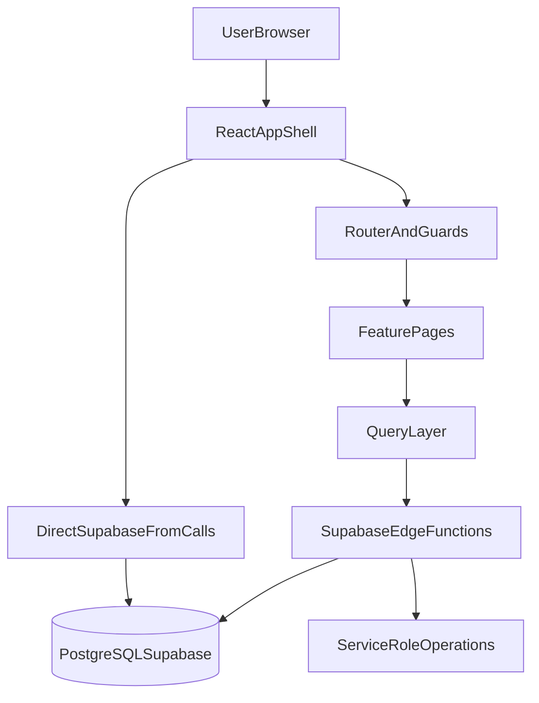
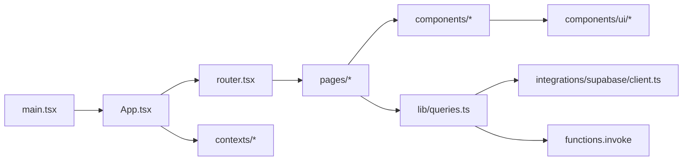
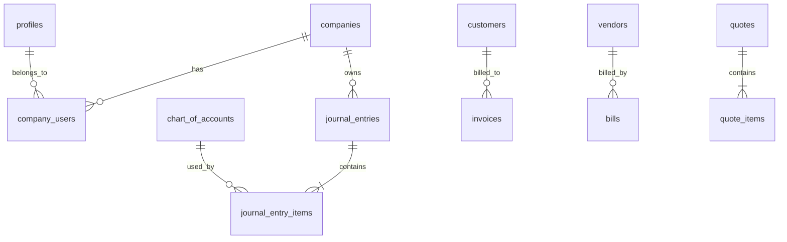

# AdminLess Fin Architecture Review Report

Date: 2026-07-02  
Review Mode: Repository-only due diligence (read-only)  
Repository: `C:/Users/TebogoM/Desktop/development projects/SmartAccounting`

## Executive Summary

AdminLess Fin has a strong product footprint and broad ERP/accounting domain coverage, with clear modular separation between frontend routes/components and Supabase edge-function domains. The platform shows intentional architecture patterns (query standardization, route guards, shared UI primitives, zod-backed forms, dark-mode tokens, and edge-function domain grouping).

The most material acquisition-risk findings are concentrated in operational controls and trust boundaries:
- Security and data-access posture relies heavily on edge-function checks plus service-role usage, while SQL migrations, RLS policies, and RPC definitions are not present in the repository for verification.
- Several frontend modules still use direct `supabase.from(...)` despite a documented edge-function-only access policy.
- Seven edge functions appear unauthenticated in code paths (email senders and cron-style jobs), creating potential abuse/exfiltration risk if JWT verification is not enforced in deployment settings.
- Engineering governance is immature for a financial platform: no automated tests, no CI pipeline artifacts, loose TypeScript strictness, and broad `@ts-nocheck` in edge functions.

Overall assessment: commercially promising foundation with notable security, reliability, and maintainability debt that should be addressed before high-scale growth or regulated enterprise onboarding.

## System Health Score (/100)

- **System Health Score:** **58/100**
- **Architecture Score:** **64/100**
- **Security Score:** **43/100**
- **Performance Score:** **59/100**
- **Accounting Score:** **61/100**
- **UX Score:** **70/100**
- **Accessibility Score:** **62/100**
- **Scalability Score:** **55/100**
- **Technical Debt Score:** **46/100** (higher is better; low indicates elevated debt)

Scoring note: scores are evidence-based from repository artifacts only. Areas without schema/RLS/RPC source are down-scored for unverifiable control coverage.

## Phase 1: Repository Overview

### Project Structure and Module Map
- Frontend app in `src` with route pages in `src/pages`, shared UI/workflow components in `src/components`, contexts in `src/contexts`, query/data helpers in `src/lib`.
- Supabase backend organized as domain edge functions in `supabase/functions` (invoices, bills, accounting, reports, payroll, assets, loans, etc.).
- Platform/build configuration in `package.json`, `vite.config.ts`, `tailwind.config.ts`, `eslint.config.js`, `tsconfig*.json`, `vercel.json`.
- Documentation currently lightweight but useful in `README.md` and `docs/DEVELOPMENT.md`.

### Feature Map (Observed)
- Core accounting: chart of accounts, journals, GL-style reporting, financial statements.
- Business operations: customers, vendors, invoices, bills, quotes, purchase orders, payments.
- Advanced domains: payroll, projects/timesheets, inventory, fixed assets, loans, budgets, tax, dashboards, chat/messages.

### Technology Stack
- React 18, TypeScript, Vite, Tailwind, Radix/shadcn-style primitives, React Query, React Hook Form + Zod, Supabase JS, Supabase Edge Functions.

### Architectural Overview
- Frontend shell: `src/main.tsx` -> `src/App.tsx` providers -> `src/router.tsx` routes.
- Access control wrappers: `src/components/ProtectedRoute.tsx`, `src/components/AdminRoute.tsx`.
- Data path intended: frontend invokes edge functions (`src/lib/queries.ts`) for DB operations.
- Deployment hint: SPA rewrite via `vercel.json`; edge functions deployed manually per docs.

### Dependency Direction
- Mostly top-down (`pages` consume `components` + `lib/queries`).
- Directional leakage exists where reusable components import types from page modules.
- Router and sidebar both encode route metadata, creating dual-maintenance coupling.

## Phase 2: Architecture Review (1-10)

- **Application architecture:** 7/10  
  Clear layered shell/providers/route guards; consistent domain segmentation.
- **Component architecture:** 6/10  
  Strong primitive reuse but multiple large mixed-responsibility components.
- **Feature boundaries:** 6/10  
  Function-level domain folders are clear; FE boundaries blur through duplicated page/form patterns.
- **Module coupling:** 5/10  
  Coupling hotspots in router/sidebar/query contracts and page-type imports.
- **Separation of concerns:** 6/10  
  Good intent, but several files combine fetch/mutate/business/render concerns.
- **Scalability architecture:** 5/10  
  No visible pagination/virtualization strategy; cron scans and unbounded lists are risk.
- **Technical debt posture:** 4/10  
  Governance/tooling debt is significant for fintech-grade expectations.
- **Architectural consistency:** 5/10  
  Documented edge-function-only policy conflicts with observed direct frontend DB calls.
- **Dependency direction quality:** 6/10  
  Mostly coherent with notable contract duplication risk.
- **Maintainability:** 6/10  
  Readable, but large files and repeated patterns increase change cost.

## Phase 3: React Review

### Observations
- Strong baseline: provider composition in `src/App.tsx`, query strategy in `src/lib/queries.ts`, form stack with zod/react-hook-form across `src/components/*Form.tsx`.
- Risks:
  - No route-level lazy loading in `src/router.tsx`.
  - Large components/pages (dashboard/reports/forms) with mixed responsibilities.
  - `form.watch(...)` usage inside repeated row renders in line-item forms.
  - `AuthContext` provider value not memoized, causing broad consumer rerenders.
  - Repeated CRUD/list patterns across many pages instead of higher-level abstractions.

### Score
- **React design and performance hygiene:** **6/10**

## Phase 4: TypeScript Review

### Observations
- `tsconfig.app.json` uses `"strict": false`.
- `tsconfig.json` has `"noImplicitAny": false` and `"strictNullChecks": false`.
- Frequent `any`, non-null assertions (`!`), and broad casts in financial and query paths.
- Positive pockets: zod-derived form types and typed entities in several pages/components.

### Score
- **Type safety and maintainability:** **4/10**

## Phase 5: Database Review

### Observations
- No SQL migrations or DDL artifacts found under `supabase` (`*.sql` not present).
- Tables/relations are inferred from edge-function usage only (cannot be formally validated).
- Multi-tenancy appears shared-schema using `company_id` + `company_users`.
- Core accounting model appears journal-centric (`journal_entries` + `journal_entry_items`) across many domains.

### Unverifiable from repository artifacts
- FK constraints, indexes, unique constraints, check constraints.
- Normalization quality and migration quality.
- Transaction boundaries and posting integrity implemented in SQL/RPC bodies.

### Score
- **Database architecture confidence:** **5/10** (down-scored for unverifiable schema controls)

## Phase 6: Supabase Review

### Observations
- Broad edge-function coverage with domain-specific handlers in `supabase/functions`.
- Common pattern: authenticate user + membership check + service-role operations.
- High-risk findings:
  - Several email/cron functions appear unauthenticated in code (`send-invoice-email`, `send-quote-email`, `send-po-email`, `send-payslip-email`, `send-statement-email`, `process-recurring-entries`, `run-depreciation`).
  - Service-role usage is widespread; mistakes in function authz checks have high blast radius.
  - Frontend direct `supabase.from(...)` usage persists despite documented prohibition in `src/integrations/supabase/client.ts`.
- RLS/policy definitions are not present in repo, so effective data isolation cannot be validated.

### Score
- **Supabase architecture and controls:** **4/10**

## Phase 7: Financial Systems Review

### Observations
- Positive:
  - Journal-based postings are applied across payroll, assets, inventory, AP/AR, and adjustments.
  - UI-level balancing checks exist in manual journal entry form.
  - Reporting uses dedicated RPCs for balances/activity/cash-flow/aging flows.
- Design weaknesses:
  - Server-side balancing and posting invariants are not visible in edge code for all entry points.
  - Some destructive reversal flows perform hard deletes of posted artifacts.
  - Numbering patterns and status transitions may rely on DB protections not present in repo.
  - Tax and reporting correctness depends heavily on opaque RPC definitions.

### Score
- **Accounting system integrity confidence:** **6/10**

## Phase 8: Security Review

### Observations
- Strengths:
  - Consistent auth checks in many functions.
  - Role gates present for selected sensitive modules.
  - Frontend/service-role secret split documented in `.env.example`.
- Major risks:
  - Potential unauthenticated edge endpoints with service-role operations.
  - Authorization gaps/IDOR-like update patterns in reconciliation flows.
  - Direct frontend PostgREST/storage access enlarges attack surface.
  - Mass-assignment style inserts/updates in multiple functions.
  - Missing RLS/storage policy source means tenant isolation is not provable from repo.

### Score
- **Security posture:** **4/10**

## Phase 9: Performance Review

### Observations
- Positive: React Query caching defaults and sidebar prefetching can improve perceived responsiveness.
- Risks:
  - No route code splitting and several heavyweight pages.
  - No clear pagination/virtualization strategy for list/report-heavy screens.
  - Multiple unbounded queries and dashboard/report fan-out.
  - Repetitive `ilike '%...%'` patterns in search likely expensive at scale.
  - Cron/domain jobs loop through large sets sequentially.

### Score
- **Performance readiness:** **6/10**

## Phase 10: UX Review

### Observations
- Positive:
  - Good module grouping in sidebar, command menu shortcut, consistent empty/loading states.
  - Forms and workflows are broadly coherent and feature-rich.
- Friction:
  - Dense navigation and duplicated route metadata.
  - Some role-nav mismatches (links exposed but route restricted).
  - Inconsistent filter/search interaction patterns and browser-native confirm dialogs.

### Score
- **UX quality:** **7/10**

## Phase 11: Design System Review

### Observations
- Positive:
  - Semantic theme tokens in `src/globals.css`, tailwind extension in `tailwind.config.ts`.
  - Broad primitive reuse under `src/components/ui` and brand system in `src/components/brand`.
- Gaps:
  - Mixed token adherence (semantic tokens + hard-coded utility colors).
  - Shared page-level shells/filter bars not fully standardized.

### Score
- **Design system consistency:** **7/10**

## Phase 12: Code Quality Review

### Observations
- Large files and repeated patterns increase maintenance load.
- Significant duplication in CRUD pages and transaction form families.
- Naming and organization are generally understandable.
- Dead code/unused dependencies cannot be conclusively measured without runtime/static analysis execution.

### Score
- **Code quality and maintainability:** **5/10**

## Phase 13: Testing Review

### Observations
- No unit/integration/e2e test files discovered.
- No test scripts in `package.json`.
- No coverage tooling or artifacts found.

### Score
- **Testing maturity:** **2/10**

## Phase 14: DevOps Review

### Observations
- Build setup exists (Vite + ESLint), but automation maturity is low.
- No CI workflow artifacts found.
- Manual edge deployment flow documented; no deploy orchestration evidence.
- Both `package-lock.json` and `pnpm-lock.yaml` exist.
- `.env` handling controls appear weak (no `.env` ignore rule observed).

### Score
- **DevOps readiness:** **3/10**

## Phase 15: AI Readiness Review

### Observations
- Positive enablers:
  - Domain-rich dataset and modular business processes provide strong AI opportunity surface.
  - Existing `ai-copilot` function indicates product direction.
- Blockers:
  - Data quality/tenancy guarantees are not fully auditable from repo.
  - Missing observability/testing/governance reduces safe AI rollout readiness.

### AI Opportunity Areas (non-implementation)
- AI bookkeeping suggestions and anomaly flags.
- Smart reconciliation recommendations.
- Predictive cash-flow and AR/AP risk forecasting.
- Document intelligence for invoice/bill ingestion.
- Natural language financial reporting assistant.
- Workflow automation copilots for repetitive back-office tasks.

### Score
- **AI readiness:** **5/10**

## Top Strengths

- Broad and coherent accounting/ERP feature coverage in a single product.
- Clear route/auth wrapper architecture and role-aware navigation patterns.
- Strong use of modern frontend primitives and form validation stack.
- Domain-separated edge-function inventory supports modular evolution.
- Journal-centric modeling present across multiple financial workflows.

## Top Weaknesses

- Security assurance is limited by missing in-repo schema/RLS/policy/RPC source.
- Potentially unauthenticated service-role edge functions are high-risk.
- Testing and CI/CD maturity are far below fintech-grade expectations.
- TypeScript strictness is weak and edge functions suppress type checking.
- Direct frontend DB access contradicts stated architecture policy.

## High-Risk Areas

- Edge-function authz consistency and JWT enforcement on email/cron endpoints.
- Multi-tenant data isolation confidence without verifiable RLS/policies.
- Financial posting invariants hidden in unseen RPC definitions.
- Production change safety with no automated tests or CI gates.

## Low-Risk Improvements

- Standardize filter toolbar and confirmation dialog UX patterns.
- Consolidate duplicated CRUD list scaffolding.
- Memoization and rerender optimization in high-frequency components.
- Reduce hard-coded color utility drift toward semantic tokens.

## Quick Wins (0-6 weeks)

- Enforce edge-function auth checks consistently and review public invoke surface.
- Remove/replace frontend direct `supabase.from(...)` write paths with function calls.
- Enable stricter TS guardrails incrementally (`noImplicitAny`, `strictNullChecks`).
- Add baseline CI: lint + build + typecheck on every PR.
- Standardize one package manager/lockfile policy.

## Medium-Term Improvements (1-2 quarters)

- Introduce automated tests for critical finance paths (journals, invoices, bills, payroll, allocations).
- Refactor large pages/forms into composable domain hooks + presentational components.
- Implement pagination/virtualization strategy for large lists and reports.
- Add structured observability (error tracking, edge function metrics, audit telemetry).
- Create shared typed contracts between frontend and edge-function methods.

## Long-Term Strategic Improvements (2+ quarters)

- Move to schema-first governance: versioned DB migrations, policy-as-code, RPC source control.
- Formalize financial engine invariants (immutable posting ledger controls, period locks, reversal strategy).
- Build platform-level authorization framework with least-privilege service boundaries.
- Create AI-safe data foundation with quality gates and explainability/audit trails.

## Critical Refactoring Candidates

- `src/router.tsx` (size, static imports, route metadata centralization).
- `src/components/SidebarNav.tsx` (route duplication and prefetch coupling).
- `src/lib/queries.ts` (stringly-typed contracts and repeated invoke wrappers).
- Large transactional forms (`InvoiceForm`, `BillForm`, `JournalEntryForm`) for decomposition.
- Domain edge functions with large method switches (`invoices`, `reports`, `settings`, `payments`).

## Modules Requiring Attention

- Security-critical: `supabase/functions/*email*`, `supabase/functions/process-recurring-entries`, `supabase/functions/run-depreciation`, `supabase/functions/accounting`.
- Architecture consistency: `src/integrations/supabase/client.ts` vs `src/components/*` direct DB usage.
- Governance/testing: root configs (`package.json`, `tsconfig*.json`, `eslint.config.js`) and absence of CI/test artifacts.

## Technical Debt Register

| ID | Debt Item | Severity | Evidence | Impact |
|---|---|---|---|---|
| TD-01 | Missing SQL migration/policy source in repo | Critical | `supabase` contains functions but no `*.sql` migrations | Unverifiable data integrity and tenant controls |
| TD-02 | Potential unauthenticated service-role functions | Critical | `supabase/functions/send-*-email`, cron-style functions | Data leakage/abuse risk |
| TD-03 | Direct frontend DB access policy drift | High | `src/components/SendInvoiceDialog.tsx`, `LoanForm.tsx`, `ReceivePaymentForm.tsx` | Expanded attack surface; inconsistent architecture |
| TD-04 | No automated tests | Critical | No test files; no test scripts in `package.json` | High regression risk in financial logic |
| TD-05 | No CI workflow artifacts | High | No `.github/workflows` | Broken quality gates before release |
| TD-06 | Loose TS strictness + broad `@ts-nocheck` | High | `tsconfig*.json`, `supabase/functions/*/index.ts` | Runtime defect risk |
| TD-07 | Router/sidebar/query coupling | Medium | `src/router.tsx`, `src/components/SidebarNav.tsx`, `src/lib/queries.ts` | Drift and maintenance overhead |
| TD-08 | Repeated CRUD and form patterns | Medium | Multiple pages/forms in `src/pages` and `src/components` | Slow delivery and inconsistency risk |
| TD-09 | No pagination/virtualization evidence | Medium | List/report pages | Performance degradation at scale |
| TD-10 | Lockfile/process inconsistency | Low | `package-lock.json` + `pnpm-lock.yaml` | Environment drift |

## Architecture Diagram

## Dependency Diagram

## Database Diagram (Inferred)

Note: ERD is inferred from code usage only; FK/index/constraint details are not verifiable from repository artifacts.

## Prioritized Roadmap

### Now (P0)
- Validate and lock down edge function auth/JWT requirements for all email and scheduled functions.
- Eliminate direct frontend DB writes where edge-function policy is intended.
- Establish mandatory CI checks: lint, build, typecheck.
- Introduce minimal high-value tests around posting/payment/void/allocation flows.

### Next (P1)
- Introduce schema-as-code: migrations, RLS policy scripts, and RPC definitions in repo.
- Improve TS rigor and remove `@ts-nocheck` from highest-risk functions.
- Decompose largest components and standardize page-level list/filter/form scaffolds.
- Add pagination and query optimization for heavy list/report flows.

### Later (P2)
- Formal accounting control framework (immutable posting strategy, reversal and lock governance).
- Advanced observability and operational SLOs for edge functions and financial workflows.
- AI feature foundation with robust data contracts, quality checks, and explainable insights.

## Observations vs Recommendations

### Observations (Evidence-backed)
- Platform breadth and modularity are strong.
- Security and financial integrity confidence are constrained by missing in-repo DB/policy/RPC assets.
- Engineering governance (tests/CI/type rigor) is insufficient for enterprise-grade finance software.

### Recommendations (Actionable)
- Prioritize trust-boundary hardening and reproducible data-governance artifacts.
- Raise quality gates before major feature expansion.
- Refactor strategic hotspots to reduce coupling and duplication.
- Sequence AI initiatives only after core control maturity improves.

## Explicitly Unverifiable Items

- SQL schema, migrations, FK/index definitions, and DB constraints.
- RLS and storage policies.
- RPC implementations and transaction-level invariants.
- Production infrastructure settings, deployment controls, and runtime telemetry.

