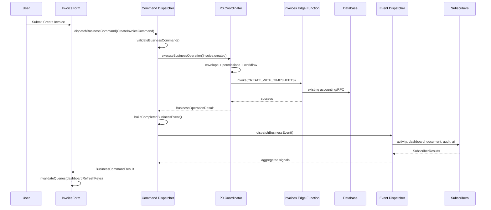

# P0.5 — Command & Event Architecture

**Date:** 2026-07-02  
**Status:** IMPLEMENTED — Architecture only, Create Invoice reference  
**Prerequisite:** P0 Execution Contract (approved, preserved)

---

## 1. Command Architecture

### Intent vs Outcome

| Concept | Represents | When Created |
|---|---|---|
| **BusinessCommand** | User intent (requested work) | Before execution |
| **BusinessEvent** | Completed business fact (outcome) | After successful execution |

### BusinessCommand Interface

Location: `src/lib/boe/commandTypes.ts`

```typescript
interface BusinessCommand<TPayload, TResult> {
  commandId: string;           // e.g. 'invoice.create'
  commandName: string;         // e.g. 'Create Invoice'
  commandVersion: string;      // '1.0'
  timestamp: string;
  companyId: string;
  userId?: string;
  userRole?: CompanyRole;
  payload: TPayload;           // Command-specific input
  outcomeEventId: string;      // Registry event emitted on success
  entityType?: string;
  entityId?: string;
  metadata?: Record<string, unknown>;
  executor: () => Promise<TResult>;  // Existing edge function call
  resolveEntityId?: (result: TResult) => string | undefined;
}
```

### BusinessCommandResult

Standard result returned by every command dispatch:

| Field | Purpose |
|---|---|
| `success` | Operation completed |
| `entityId` / `entityType` | Affected entity |
| `event` | Completed `BusinessEvent` |
| `nextRecommendedAction` | From registry / orchestration |
| `documentsProduced` | Document types produced |
| `notificationsTriggered` | Notification signals |
| `dashboardRefreshKeys` | React Query invalidation keys |
| `activityEntries` | Activity feed entries |
| `auditReference` | Audit correlation |
| `operation` | Full P0 `BusinessOperationResult` (backward compatible) |

### Reference Command

Location: `src/lib/boe/commands/createInvoiceCommand.ts`

- Command ID: `invoice.create`
- Outcome event: `invoice.created`
- Factory: `buildCreateInvoiceCommand()`

---

## 2. Event Architecture

### Completed BusinessEvent

Location: `src/lib/boe/events/businessEvent.ts`

Distinct from registry definitions in `businessEvents.ts`:

```typescript
interface BusinessEvent {
  eventId: string;
  eventName: string;
  eventVersion: string;
  occurredAt: string;
  companyId: string;
  actorId?: string;
  lifecycleId: LifecycleId;
  lifecycleStageId: string;
  entityType?: string;
  entityId?: string;
  accountingImpact: boolean;
  documentTypes: string[];
  metadata?: Record<string, unknown>;
  commandId: string;      // Links to originating command
  correlationId: string;  // End-to-end trace ID
}
```

Events are published **after** the edge function succeeds, never before.

---

## 3. Subscriber Registry

Location: `src/lib/boe/subscribers/registry.ts`

| Subscriber | File | Reacts To |
|---|---|---|
| ActivitySubscriber | `activitySubscriber.ts` | All lifecycle events |
| DashboardSubscriber | `dashboardSubscriber.ts` | Registry-known events |
| NotificationSubscriber | `notificationSubscriber.ts` | Events with notification targets |
| DocumentSubscriber | `documentSubscriber.ts` | Events with document types |
| AuditSubscriber | `auditSubscriber.ts` | Events with audit pipeline stage |
| CalendarSubscriber | `calendarSubscriber.ts` | Calendar-relevant events |
| AISubscriber | `aiSubscriber.ts` | Advisory-eligible events |

### Subscriber Contract

Location: `src/lib/boe/subscribers/contracts.ts`

```typescript
interface BusinessEventSubscriber {
  subscriberId: string;
  handles: (event: BusinessEvent) => boolean;
  onEvent: (event: BusinessEvent) => Promise<SubscriberResult> | SubscriberResult;
}
```

**Subscribers are UI-agnostic.** They return signals only; the UI consumes `BusinessCommandResult`.

API:
- `getSubscribers()` — list registered subscribers
- `registerSubscriber()` — extend at runtime
- `resetSubscribers()` — restore defaults (testing)

---

## 4. Command Dispatcher

Location: `src/lib/boe/dispatchers/commandDispatcher.ts`

```
dispatchBusinessCommand(command)
  ① validateBusinessCommand()
  ② executeBusinessOperation()     ← P0 unchanged
  ③ buildCompletedBusinessEvent()
  ④ dispatchBusinessEvent()
  ⑤ mergeSubscriberResults()
  ⑥ return BusinessCommandResult
```

P0 `executeBusinessOperation()` is called internally — not rewritten.

---

## 5. Event Dispatcher

Location: `src/lib/boe/dispatchers/eventDispatcher.ts`

```
dispatchBusinessEvent(event)
  → for each subscriber in registry
      → if subscriber.handles(event)
          → subscriber.onEvent(event)
  → return aggregated SubscriberResult[]
```

---

## 6. Updated Execution Diagram

### P0 (preserved)

```
UI → executeBusinessOperation → Edge Function → DB → invalidation keys
```

### P0.5 (current)



### Layer Separation

```
┌─────────────────────────────────────────────────────────┐
│  COMMAND LAYER (intent)                                 │
│  buildCreateInvoiceCommand → dispatchBusinessCommand    │
├─────────────────────────────────────────────────────────┤
│  P0 COORDINATOR (orchestration — unchanged)            │
│  executeBusinessOperation → envelope, permissions       │
├─────────────────────────────────────────────────────────┤
│  EXECUTION LAYER (unchanged)                            │
│  supabase.functions.invoke('invoices', ...)             │
├─────────────────────────────────────────────────────────┤
│  EVENT LAYER (facts)                                      │
│  BusinessEvent → dispatchBusinessEvent                  │
├─────────────────────────────────────────────────────────┤
│  SUBSCRIBER LAYER (reactions — UI-agnostic)             │
│  Activity, Dashboard, Document, Audit, AI, Calendar     │
└─────────────────────────────────────────────────────────┘
```

---

## 7. Verification Report

### Quality Gates

| Gate | Status | Evidence |
|---|---|---|
| P0 behaviour preserved | ✓ PASS | `commandDispatcher` calls `executeBusinessOperation` unchanged |
| No accounting changes | ✓ PASS | Edge function payload identical in `InvoiceForm` |
| No database changes | ✓ PASS | No migrations |
| No edge function changes | ✓ PASS | No `supabase/functions` edits |
| No additional workflow migrations | ✓ PASS | Only Create Invoice uses command dispatcher |
| Build passes | ✓ PASS | `npm run build` — 14.26s, 0 errors |
| New BOE files lint-clean | ✓ PASS | No linter errors in `src/lib/boe/` |

### Files Added

| File | Purpose |
|---|---|
| `src/lib/boe/commandTypes.ts` | Command + result interfaces |
| `src/lib/boe/events/businessEvent.ts` | Completed event interface |
| `src/lib/boe/subscribers/contracts.ts` | Subscriber contract |
| `src/lib/boe/subscribers/*.ts` | 7 independent subscribers |
| `src/lib/boe/subscribers/registry.ts` | Subscriber registry |
| `src/lib/boe/dispatchers/commandDispatcher.ts` | Command dispatcher |
| `src/lib/boe/dispatchers/eventDispatcher.ts` | Event dispatcher |
| `src/lib/boe/commands/createInvoiceCommand.ts` | Reference command |

### Files Modified

| File | Change |
|---|---|
| `src/lib/boe/index.ts` | Export command/event architecture |
| `src/components/InvoiceForm.tsx` | Create path uses `dispatchBusinessCommand` |

### Files Unchanged (P0 preserved)

| File | Status |
|---|---|
| `src/lib/boe/executionContract.ts` | **Untouched** |
| `supabase/functions/invoices/index.ts` | **Untouched** |
| All other mutation forms | **Untouched** |

### P0 vs P0.5 Invoice Create Trace

**Before P0.5:**
```
InvoiceForm → executeBusinessOperation → invoke('invoices') → invalidationKeys
```

**After P0.5:**
```
InvoiceForm → buildCreateInvoiceCommand → dispatchBusinessCommand
  → executeBusinessOperation (P0)
  → invoke('invoices') (identical payload)
  → BusinessEvent published
  → 5 subscribers react
  → dashboardRefreshKeys (fallback to P0 keys if subscribers empty)
```

### Regression Risk

| Area | Risk | Mitigation |
|---|---|---|
| Invoice create payload | None | Same `CREATE_WITH_TIMESHEETS` body |
| Invoice edit path | None | Still direct `invoke` |
| Invalidation keys | Low | Dashboard subscriber derives same keys; falls back to P0 `operation.invalidationKeys` |
| Performance | Negligible | ~7 synchronous subscriber calls post-success |

### Sprint Gate

| Criterion | Status |
|---|---|
| Command architecture | ✓ |
| Event architecture | ✓ |
| Subscriber registry | ✓ |
| Command dispatcher | ✓ |
| Event dispatcher | ✓ |
| CreateInvoiceCommand reference | ✓ |
| No P1 migrations | ✓ |

**Ready for P0.5 review.** P1 (Revenue workflow migration) must not begin until approved.

### Canonical Pattern for P1

```typescript
import { buildCreateInvoiceCommand, dispatchBusinessCommand } from '@/lib/boe';

const command = buildXxxCommand({ ...params, executor: () => existingInvoke() });
const result = await dispatchBusinessCommand(command);
// UI consumes result.dashboardRefreshKeys, result.activityEntries, etc.
```
