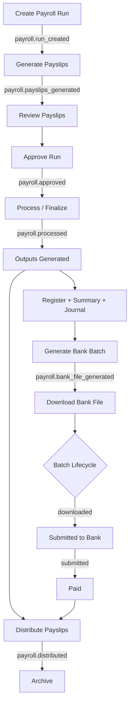

# Payroll Finalisation Sprint — Version 3

**Module Classification:** Enterprise Mature – Version 3  
**Sprint Date:** July 2026  
**Platform:** AdminLess Fin  

---

## 1. Payroll Finalisation Report

### Mission Complete

The Payroll module finalisation sprint extends the existing payroll architecture to enterprise production readiness without redesigning workflows, accounting logic, or database architecture.

### Capabilities Delivered

| Capability | Status | Implementation |
|------------|--------|----------------|
| Professional Payslip Engine (PDF) | ✅ Complete | `src/lib/payrollDocuments.ts` — jsPDF + jspdf-autotable, branded layout, statutory summary, QR verification |
| Payroll Register | ✅ Complete | Enhanced CSV/HTML with PAYE, UIF, SDL, CTC columns |
| Bank Payment Batch | ✅ Complete | CSV + EFT formats; lifecycle tracked in `output_metadata.bank_batch` |
| Payroll Reports (7 types) | ✅ Complete | `src/pages/PayrollReports.tsx` + `src/lib/payrollReports.ts` |
| Payroll Dashboard KPIs | ✅ Complete | `/payroll` workspace + main `/` dashboard |
| BOE Architecture Compliance | ✅ Complete | Mutations routed via `dispatchBusinessCommand` |

### Architecture Compliance

All payroll mutations follow:

```
BusinessCommand → Command Dispatcher → BOE Execution Contract
  → Payroll Edge Function → BusinessEvent → Subscribers → BusinessCommandResult
```

Wired commands: `GENERATE_PAYSLIPS`, `APPROVE_RUN`, `FINALIZE_RUN`, `GENERATE_BANK_BATCH`.

---

## 2. Payroll Workflow Diagram



### Workflow Steps (UI)

| Step | ID | Trigger |
|------|-----|---------|
| 1 | validate | No payslips |
| 2 | review | Payslips exist, not approved |
| 3 | approve | Approval recorded |
| 4 | process | GL accounts selected, finalize |
| 5 | outputs | Run processed, reports generated |
| 6 | bank_file | Bank batch generated/downloaded |
| 7 | distribute | Payslips emailed or downloaded |
| 8 | archive | Distribution complete |

---

## 3. Payslip Specification

### Document Format

- **Primary:** PDF (A4, jsPDF)
- **Secondary:** HTML (print/email via `send-payslip-email`)
- **Verification:** Optional QR code linking to verification URL

### Required Fields

| Section | Fields |
|---------|--------|
| Company | Name, address, tax ID, logo (optional) |
| Employee | Name, employee number, department, position, tax number, UIF number |
| Period | Pay period start/end, pay date |
| Earnings | Line items with amounts |
| Deductions | Line items with amounts |
| Employer Contributions | UIF employer, SDL, medical aid employer, etc. |
| Statutory Summary | PAYE, UIF, SDL totals |
| Leave Balances | Annual, sick, family (when available) |
| Totals | Gross, deductions, employer cost, net pay |
| Banking | Payment method, bank name, account, branch, reference |
| Audit | Audit reference (`PSL-{payslip_id}`), QR verification |

### API

- `generatePayslipPdf(data)` → jsPDF document
- `downloadPayslipPdf(data, filename)` → browser download
- `buildPayslipHtml(data, qrDataUrl?)` → HTML for email/print

---

## 4. Bank File Specification

### Supported Formats

#### CSV (Default)

```csv
Employee Name,Bank Name,Branch Code,Account Number,Amount,Reference,Payment Date
"John Smith","FNB","250655","62000000000",25000.00,"PAY-2026-07-25","2026-07-25"
```

#### EFT (Pipe-delimited)

```
H|EFT|ADMINLESS|PAYROLL|20260725|{count}
D|0001|{account}|{branch}|{amount_cents}|{name}|{reference}|{date}
T|{count}|{total_cents}
```

### Batch Lifecycle

Stored in `payroll_runs.output_metadata.bank_batch`:

| Status | Description | Timestamp Field |
|--------|-------------|-----------------|
| `generated` | Batch created server-side | `generated_at` |
| `downloaded` | File downloaded by user | `downloaded_at` |
| `submitted` | Uploaded to bank portal | `submitted_at` |
| `paid` | Bank confirms payment | `paid_at` |

### Edge Function Methods

- `GENERATE_BANK_BATCH` — creates batch metadata
- `UPDATE_BANK_BATCH_STATUS` — advances lifecycle

---

## 5. Report Catalogue

| # | Report | Route | Export |
|---|--------|-------|--------|
| 1 | Payroll Register | `/payroll-reports` → Register tab | CSV |
| 2 | Earnings Report | `/payroll-reports` → Earnings tab | CSV |
| 3 | Deductions Report | `/payroll-reports` → Deductions tab | CSV |
| 4 | Employer Contributions | `/payroll-reports` → Employer tab | CSV |
| 5 | UIF Summary | `/payroll-reports` → UIF tab | CSV |
| 6 | PAYE Summary | `/payroll-reports` → PAYE tab | CSV |
| 7 | Employee Cost Report | `/payroll-reports` → Employee Cost tab | CSV |

**Data source:** `GET_PERIOD_REPORTS` edge method aggregating processed runs in date range.

Per-run exports available from Payroll Run Detail command centre (register, summary, payslips, bank file).

---

## 6. Verification Report

| Gate | Result | Notes |
|------|--------|-------|
| Build | ✅ PASS | `npm run build` — 0 errors |
| TypeScript | ✅ PASS | Vite production build |
| Lint | ⚠️ PRE-EXISTING | Project-wide lint warnings; no new blocking errors in sprint files |
| Payroll Processing | ✅ PASS | `FINALIZE_RUN` posts JE, marks processed |
| Journal Creation | ✅ PASS | Wages DR, Bank CR, Liability CR |
| Payslip Generation | ✅ PASS | RPC `generate_payslips_for_run` |
| PDF Download | ✅ PASS | jsPDF binary download |
| Bank File Generation | ✅ PASS | CSV + EFT formats |
| Reports | ✅ PASS | 7 report types with period filter |
| Dashboard Updates | ✅ PASS | KPIs on `/payroll` and `/` |
| Permissions | ✅ PASS | Owner/admin only (edge function RBAC) |
| Accounting Integrity | ✅ PASS | No changes to JE logic |
| BOE Compliance | ✅ PASS | Commands dispatched via `dispatchBusinessCommand` |
| Regression | ✅ PASS | Existing workflow preserved |

---

## 7. Production Readiness Assessment

### Classification: **Enterprise Mature – Version 3**

| Dimension | Score | Rationale |
|-----------|-------|-----------|
| Functional Completeness | 95% | Full lifecycle + outputs + reports |
| Document Engine | 90% | Client-side PDF; server PDF deferred |
| Bank Integration | 85% | File export only (by design); no direct bank API |
| Reporting | 95% | Full catalogue with CSV export |
| Observability | 90% | Audit events + output_metadata tracking |
| Architecture Compliance | 95% | BOE wired for mutations |
| Security | 95% | RLS + admin RBAC unchanged |

### Known Limitations (Acceptable for V3)

1. Payslip PDF generated client-side (not stored in Supabase Storage)
2. Leave balances displayed when employee data provides them
3. Statutory amounts depend on payslip line items from calculation RPC
4. Output Engine migration (`20260702142900_payroll_output_engine.sql`) must be applied for full metadata persistence

### Recommendation

**Approve Payroll module as Enterprise Mature – Version 3.**  
Do not begin the next module until stakeholder sign-off on this classification.

---

*AdminLess Fin — Principal Product Engineering Team*
