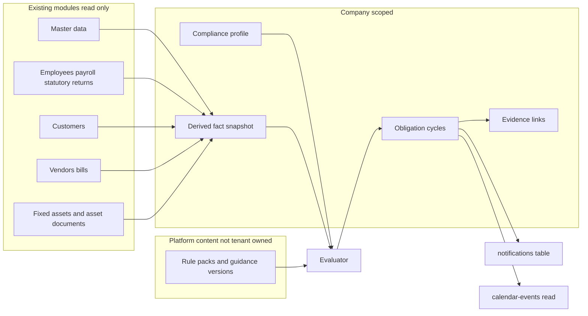

# Compliance & Governance — Principal Implementation Plan

**Status:** Draft for review. Not an ADR. Not certified. No application code, schema, or packages have been changed.
**Date:** 2026-09-30
**Product:** AdminLess Fin (`adminless-fin`)
**Workspace:** `c:\Users\TebogoM\Desktop\development projects\SmartAccounting`

Investigation only. No code, schema, or package changes in this step. Source of truth is the current AdminLess Fin repo (`adminless-fin`).

**Scope decision (recommended, confirm before coding):** build a narrow tenant obligation workspace. Do not implement the 13-domain Enterprise Governance & Compliance Platform. That design is certified documentation only: [docs/enterprise-governance-compliance/V5.0.0/07_ENTERPRISE_READINESS_ASSESSMENT.md](docs/enterprise-governance-compliance/V5.0.0/07_ENTERPRISE_READINESS_ASSESSMENT.md) states the pack does **not** implement services, schema, Edge Functions, or UI. Implementing DoA, risk libraries, control testing, and a second legislation repository in the same programme would collide with frozen payroll law in [src/statutory/](src/statutory/) and with accounting policy/rules engines.

Naming collision to avoid: [src/governance/](src/governance/) is the company-admin foundation (financial calendar, company branding, master-data proxy, accounting policies, team security). `efs_company_master_data.governance` is company secretary / auditor / accounting officer. Neither is this module.

---

## 1. Current architecture findings

- **Stack.** Vite 6, React 18.3, `react-router-dom` 6, TanStack Query 5, `react-hook-form` + `zod` + `@hookform/resolvers`, shadcn/ui (Radix + Tailwind), `lucide-react`, Supabase JS. No Zustand, Redux, or Jotai.
- **Shell.** [src/main.tsx](src/main.tsx) wraps theme and startup checks. [src/App.tsx](src/App.tsx) mounts `QueryClientProvider` → `BrowserRouter` → `AuthProvider` → `ReportingPeriodProvider` → `AppRouter`. Query defaults: 5 min stale, 30 min gc, retry 1, no refetch on focus.
- **Routes live in [src/router.tsx](src/router.tsx), not `App.tsx`.** Pages are lazy except auth and guards. Guards: `ProtectedRoute` (session + active company), `AdminRoute` (`owner` or `admin`), `AccountingReadyGate`, `FinancialStatementsGate`, `FinancialCloseGate`, `BetaAnalyticsRoute`.
- **Nav.** [src/components/SidebarNav.tsx](src/components/SidebarNav.tsx). `isAdmin = role === 'owner' || role === 'admin'`. Settings is not in the sidebar; [src/components/Layout.tsx](src/components/Layout.tsx) header dropdown, admin only.
- **Auth.** [src/integrations/supabase/client.ts](src/integrations/supabase/client.ts) allows `auth`, `functions.invoke`, and `storage` only. Direct `supabase.from()` is prohibited (a few violations remain: bank accounts, loans, send-invoice/quote/PO). [src/contexts/AuthContext.tsx](src/contexts/AuthContext.tsx) hydrates via edge `user-session`. `profiles.active_company_id` is the persisted company. `switchCompany` is the only mutation path.
- **Roles.** `company_users.role` enum `owner | admin | member`. No finer permission table. [src/governance/types.ts](src/governance/types.ts) `GovernancePermissionBoundary` is declared per domain and **not enforced**. [src/governance/domains/security/service.ts](src/governance/domains/security/service.ts): centralized allow/deny “intentionally does NOT yet” exist.
- **Edge tenancy.** [supabase/functions/_shared/enterpriseEdgePlatform.ts](supabase/functions/_shared/enterpriseEdgePlatform.ts): `bootstrapTenantRequest` checks membership, not role. Admin modules add a local `requireAdmin`. Writes use the service-role client. Atomic write RPCs are service-role only ([supabase/migrations/20260930140000_the_write_rpcs_are_service_role_only.sql](supabase/migrations/20260930140000_the_write_rpcs_are_service_role_only.sql)).
- **RLS.** Policies in `supabase/migrations/` typically `is_company_member(company_id)` or a `company_users` join. `is_company_member` / `is_admin_of` are used widely but defined in the remote baseline, not in a readable CREATE FUNCTION in tracked migrations. **INVESTIGATION REQUIRED** before copying that helper into new policies: confirm the function signature on the target database.
- **Three “governance” layers, none of which is this product:**
  - `src/governance` — live company/admin proxies. Flags in [src/governance/featureFlags.ts](src/governance/featureFlags.ts). `workflow`, `tax`, `currencies`, `auditConfiguration`, `documentConfiguration` are `false` and throw if called.
  - Accounting Policy Engine and Accounting Rules Engine — Postgres, posting-pipeline only. Rules match a `business_event`, integer `version`, company override over system. **No condition DSL and no effective dates.**
  - Statutory payroll — immutable TypeScript per tax year under `src/statutory/`, with `effectiveFrom` / `effectiveTo` / checksum. Runtime may overlay `payroll_tax_year_config`. This is calculation law, not a filing calendar.
- **Company identity.** Operational `companies`: `name`, `address`, `logo_url`, `tax_id` (legacy), invoice/quote defaults. Legal identity is `efs_company_master_data` (one row per company): `company_profile` (`registered_name`, `trading_name`, `registration_number`, `nature_of_business`, `entity_type`, `country_of_incorporation`), `addresses`, `tax_registrations` (`vat_number`, `income_tax_number`, `paye_number`, `sdl_number`, `uif_number`), `directors`, `governance`, `officers`, `principal_bankers`. Types: [src/lib/financialStatements/masterData/types.ts](src/lib/financialStatements/masterData/types.ts). There is **no employee-count field** and **no industry enum**. `nature_of_business` is free text. `IndustryProfile` in the financial-statements reporting engine is computed, not stored.
- **Onboarding does not collect compliance facts.** [src/pages/CreateCompany.tsx](src/pages/CreateCompany.tsx) collects company name only, then [src/pages/accounting/AccountingSetupWizard.tsx](src/pages/accounting/AccountingSetupWizard.tsx) collects financial calendar, chart of accounts, tax rates, bank, opening balances, validation. Legal fields are later, in Settings → Master Data. Copy in [src/lib/onboarding/copy.ts](src/lib/onboarding/copy.ts). No questionnaire component exists.
- **Documents are not a shared vault.** Bucket `attachments` is **public** (`public: true` in [supabase/migrations/20260729150000_production_attachments_storage.sql](supabase/migrations/20260729150000_production_attachments_storage.sql)), path `{company_id}/...`, company-member RLS. Files are URL columns on bills, POs, journals, expense claims, loans. `asset_documents` is the only real child-document table (URL paste, not always an upload). **No employee, vendor, or customer document tables.** `documentConfiguration` is an inactive invoice-numbering stub, not file storage. `efs_supporting_evidence` belongs to financial-statement workpapers.
- **Notifications exist as a shell with no writer.** Table `notifications` (`user_id`, `company_id`, `content`, `link_to`, `is_read`). [src/components/NotificationBell.tsx](src/components/NotificationBell.tsx) reads the last 10 and subscribes to Realtime. Nothing in the repo inserts rows. BOE notification effects defer to email. **INVESTIGATION REQUIRED:** confirm insert/select RLS on `notifications` before using it as the reminder sink.
- **Calendar is read-only aggregation.** `/calendar` ([src/pages/FinancialCalendar.tsx](src/pages/FinancialCalendar.tsx)) shows invoice/bill due dates, payroll dates, and recurring next-run dates via `calendar-events`. Governance financial calendar is `financial_years` / `accounting_periods` only. No arbitrary reminder rows.
- **Tasks.** `ewm_tasks` have no `due_date`. `efcp_close_items` are financial-close checklist rows. Recurring invoices/bills/journals are document-generation schedules (`frequency`, `next_run_date`), driven by pg_cron in production (jobs are documented, not defined in repo migrations).
- **Audit.** Generic `audit_logs` via per-table trigger `process_audit_log()`. Settings → Security shows `AuditLogViewer`. Accounting has `/accounting/audit-trail`. `/audit-compliance-reports` is the Enterprise VIP payroll working paper, not a statutory-obligation register.
- **Feature-flag pattern to copy.** [src/lib/financialStatements/flags.ts](src/lib/financialStatements/flags.ts) and [src/lib/financialClose/flags.ts](src/lib/financialClose/flags.ts): `VITE_*_MODULE`, `VITE_*_NAV_SIDEBAR`, `VITE_*_ALLOWLIST`. Owner/admin pass persona; member needs allowlist. Static `import.meta.env.VITE_*` only.
- **Freezes.** CoA (ADR-0001) and Canonical Financial Aggregation (ADR-0003) stay untouched. Compliance must not sum journals, invoices, VAT, or balances, and must not add account roles.

## 2. Reuse

- Route + lazy page + `AdminRoute` + sidebar group + Vite env flags (EFS/EFCP pattern).
- `useAuth().activeCompany.id` as the only tenant key. `ReportingPeriodContext` is for financial workspaces; compliance due dates are their own dates, not the reporting period.
- Edge platform: `bootstrapTenantRequest` plus an explicit admin role check inside the new function.
- Forms: `useForm` + `zodResolver` + shadcn `Form` + [src/components/ui/form-dialog.tsx](src/components/ui/form-dialog.tsx) dirty-close guard. Long wizard: URL `?step=` like accounting setup, plus `useFormPersistence`.
- Server state: TanStack Query factories beside the module, company-scoped keys. Do not add the module to the [src/lib/queries.ts](src/lib/queries.ts) barrel (SidebarNav already had to stop namespace-importing that file because it pulled the whole graph into the initial bundle).
- In-app delivery: existing `notifications` row shape and `NotificationBell`, once RLS is verified. Email: existing `send-*` functions only as a later channel, not a new mailer.
- Calendar presentation: add a **read source** inside `calendar-events`, same way recurring invoices are merged. Do not store compliance dates in `accounting_periods`.
- Schedule mechanics to copy, not tables to reuse: `frequency` + `next_due_date` + cron scan (`process-recurring-*` pattern).
- Versioning idea to copy from statutory metadata (`effectiveFrom`, `effectiveTo`, `ruleVersion`, immutable once published) and from accounting rules (system row vs company override, execution log). Store that in **new** tables. Do not insert CIPC rules into `accounting_rule_definitions`.
- Master data as read-only facts via the existing enterprise identity / master-data readers. Deep-link gaps to `/settings?tab=master-data&module=...`.
- Audit: attach `process_audit_log()` to new tenant tables the same way credit notes did, so Settings audit log can see status changes. Confirm the trigger resolves `company_id` on the new shape. **INVESTIGATION REQUIRED** at migration design time.
- Help UI pattern: small info/ellipsis using existing shadcn `Popover` or `DropdownMenu`. Content comes from the API.

## 3. Do not duplicate

- Do not put this module inside `src/governance` or flip dormant flags (`workflow`, `tax`, `documentConfiguration`) to mean statutory compliance.
- Do not implement EGCP domains beyond a legislation-pack slice, an applicability evaluator, obligation instances, evidence pointers, and a statutory calendar **view**. Out of scope: Policy Engine (already the accounting one), Delegation of Authority, Risk & Control, Control Testing, Exception/waiver management, Compliance Intelligence scoring, Governance Reporting packs.
- Do not fork payroll law out of `src/statutory/`. EMP201, IRP5, PAYE, UIF, SDL stay in Payroll → Statutory Returns. Compliance may **list** “EMP201 is due” as an obligation whose evidence link points at a finalized `statutory_returns` row. It must not recalculate tax.
- Do not create `employee_documents`, vendor SLA tables, or customer file cabinets inside Compliance. Those records do not exist today. Until Payroll or Purchases own them, Compliance shows “source record has no document yet” and does not invent a second repository.
- Do not reuse `efs_supporting_evidence`, `efcp_close_items`, `ewm_tasks`, `recurring_*`, or `messages`.
- Do not write questionnaire answers back into `efs_company_master_data` or `companies`.
- Do not add a second notification bell, chat channel, or task product.
- Do not evaluate rules in React.

## 4. Proposed architecture

- **UI.** New lazy route group under `/compliance`, wrapped in `AdminRoute` and a `ComplianceGate` that reads `VITE_COMPLIANCE_MODULE` (default off). Sidebar section “Compliance & Governance” only when the nav flag is on and `isAdmin`.
- **Code home.** `src/compliance/` (pages, hooks, zod schemas, query keys) and `supabase/functions/compliance/`. Do not register a `src/governance` domain for this.
- **Evaluation.** Edge function only, on profile save, manual refresh, and a daily cron. Results are **materialized** obligation rows. The dashboard queries those rows. React never interprets rule JSON.
- **Content vs tenant data.** Platform packs have no `company_id` (EGCP principle P5). Profiles, answers, obligation cycles, evidence links, and reminder dispatches always have `company_id`.
- **Industries are data.** Core categories are rows: Corporate & CIPC, Tax & SARS, Employment, Information & Privacy, B-BBEE, General Governance. Industry packs (artists, creators, salons, ECD, security, retail/spaza, construction, transport, other) are `industry_code` values on rules. Adding an industry is a published pack version, not a new route or component tree.
- **Jurisdiction.** `country_code` on every pack, default `ZA`, matching the statutory country registry. Schema allows another country later. v1 seeds South Africa only.
- **First screen.** If `compliance_profiles.completed_at` is null, `/compliance` opens the questionnaire. Every other module is unchanged. Existing companies never see it until an admin opens the module.

## 5. Module integration map

Read-only. No writes into these tables. No new business-event subscribers in v1 (there is no `employee.created` event to hook, and posting-engine hooks would risk accounting). Refresh facts on questionnaire save, manual refresh, and daily cron.

- **Settings / master data.** Read `efs_company_master_data`: registration number, entity type, nature of business, addresses, VAT and other tax numbers, directors, officers. Link gaps to Master Data. Do not copy the JSON into a second legal profile.
- **Payroll.** Read `employees` (active count, employment types), `payroll_runs`, `payslips`, `statutory_returns`, readiness flag `payroll_enabled`, PAYE/SDL/UIF numbers. Employment obligations reference a payroll run or statutory return id. Contracts: **no store exists**.
- **Purchases.** Read `vendors` and bill/PO `attachment_url` only as optional pointers. No SLA table exists.
- **Sales.** Read `customers` for “has customers / processes personal data” hints. Customer contracts: **no store exists**.
- **Accounting.** Read readiness (tax rates, VAT control mapping, bank, periods) as facts. Do not read journal lines to decide applicability. Do not post journals from compliance.
- **Assets.** Read `fixed_assets` and `asset_documents` (insurance, inspection, certificate). Evidence of type `reference` may point at `asset_documents.id`. Compliance does not insert asset rows.
- **Banking, Inventory, Treasury.** Existence signals only (`bank_accounts`, `inventory_enabled`, `loans`). No document ownership.
- **Financial Close / Financial Statements.** No shared tables. Close checklist and AFS evidence stay in `efcp_*` and `efs_*`. A future link may point at a published statement; v1 does not.
- **Operations calendar.** Optional read of compliance `next_due_date` inside `calendar-events`, behind the same flag, so a missing compliance table cannot break the calendar (query isolated, empty array on flag off).
- **Work Management.** No task creation in v1.
- **Collaborate.** Not a reminder channel.
- **Circular dependency rule.** Payroll, accounting, posting, and master-data services must not import `src/compliance`. Calendar may call the compliance edge read or a SQL view. Compliance may call existing master-data and payroll **read** APIs.

## 6. Questionnaire architecture

Not part of `/create-company` or `/accounting-setup`.

One row per company: profile status `not_started | in_progress | complete`, `completed_at`, `rule_pack_version_id` used at last evaluation.

**Derived facts (do not ask if present):**

- Legal name, CIPC-style `registration_number`, `entity_type` — master data `company_profile`.
- VAT — `tax_registrations.vat_number` and/or a company `tax_rates` row. There is no `vat_registered` boolean. Empty number means unknown, not “not registered”.
- Payroll / employees — `count(employees where employment_status = active)`, any `payroll_runs`, PAYE/SDL/UIF numbers, `payroll_enabled`.
- Premises — any of registered/business/physical address in master data. Presence is a hint only.
- Assets, inventory, loans — row or readiness-flag existence.
- Directors — `directors[]` length.

**Must be asked (cannot be derived safely):**

- Industry pack. `nature_of_business` is free text. Keyword guessing (salon, spaza, ECD) is unsafe. **Do not auto-map it.** Ask an explicit industry list plus “other”.
- Activities that change obligations even inside an industry: transport, food, security, construction, childcare, processing of personal information beyond ordinary customer invoicing.
- Physical premises yes/no when address is blank.
- VAT status when `vat_number` is null: “registered / not registered / not sure”. “Registered” does not write a VAT number; it deep-links to Master Data and stores the answer only on the compliance profile.

**Write policy.** Answers live on the compliance profile. If they contradict master data, show both and link to Settings. Never overwrite master data from the questionnaire.

**UI.** Wizard page at `/compliance/profile`, zod schema per step, `?step=` in the URL, `useFormPersistence` so a refresh does not wipe answers (AuthContext already avoids wiping `activeCompany` on transient errors for this reason). Skip steps whose facts are already known; show them as read-only “already on file”.

**Re-entry.** Completed profile can be edited. Editing bumps a profile revision and re-runs evaluation. It does not delete history of past obligation cycles.

## 7. Rules engine

Follow statutory **versioning** and accounting-rules **separation of catalog vs execution**, in new tables. Do not hard-code conditions in components. Do not reuse `accounting_rules_resolve` (it generates journals).

**Pack (platform):** `code`, `country_code`, `category_code`, `industry_code` null for core, `version` integer, `status` `draft | published | retired`, `effective_from`, `effective_to`, immutable after publish. New version = new row. Tenants cannot update published rows.

**Condition:** small JSON predicate evaluated only on the server against the fact snapshot. v1 operators: `fact_eq`, `fact_gt`, `fact_present`, `any_of`, `all_of`. Facts are a closed set (`has_employees`, `employee_count`, `vat_status`, `entity_type`, `industry_code`, `has_premises`, `activity_transport`, `activity_food`, `activity_security`, `activity_construction`, `activity_childcare`, `processes_personal_information`, `has_registration_number`). Unknown fact = rule does not match (fail closed). No arbitrary JavaScript.

**Then:** create or refresh one obligation **definition** binding: category, authority, frequency, due-date rule, expiry rule, evidence requirement, priority, default reminder offsets, guidance id.

**Due-date rule (data, not code):** `annual_fixed_month_day`, `days_after_event`, `interval_from_completion`, `certificate_expiry`. v1 implement `annual_fixed_month_day` and `certificate_expiry` only. Other frequencies are stored but not scheduled until a later phase.

**Company override:** not in v1. Companies cannot turn off a published statutory rule. They can mark a cycle “not applicable” with a reason, which is tenant state, not a rule edit.

**Execution log:** each evaluation writes `profile_revision`, `pack_version`, timestamp, and which rules matched. Needed so a later pack publish does not silently rewrite history.

**Who publishes.** There is no platform-admin role in `company_users`. v1 publication is a migration/seed performed by engineering. No in-app rule editor. **INVESTIGATION REQUIRED** before any tenant-facing authoring UI: a platform role outside company RBAC.

## 8. Obligation lifecycle

Separate **applicability**, **work status**, and **time signals**. Do not store “Due Soon” or “Overdue” as the only status; they go stale overnight.

**Applicability (derived):** `applicable` or `not_applicable`. Not applicable still keeps the row so the user can see why it dropped off, with the rule version that decided it.

**Work status (stored, user or workflow):**

- `not_started`
- `in_progress`
- `evidence_submitted`
- `compliant` (this cycle is done)
- `action_required` (evidence rejected or date missing)

`under_review` is **not** a v1 status. The only roles are owner/admin/member, and member will not access the module in v1, so a reviewer queue has no distinct actor. Add it only if a later decision introduces a reviewer.

**Time signals (computed at read time):**

- `due_soon` — applicable, not `compliant`, `next_due_date` within the reminder window.
- `overdue` — applicable, not `compliant`, `next_due_date` before today.
- `expired` — certificate-style obligation whose `expiry_date` is before today. Independent of `compliant`.

**Recurring filing vs expiring certificate:**

- Filing (CIPC annual return): one **cycle row** per period (`period_key`, `due_date`, `completed_at`). Marking compliant closes that cycle and the evaluator opens the next cycle. History stays.
- Certificate (licence, clearance): one obligation with `expiry_date`. Renewal sets a new expiry and appends a history event. It does not spawn a filing period.

**Fields on a cycle:** requirement code, category, authority, why it applies (snapshot sentence from the rule), guidance version id, due date, completed date, expiry date if any, next due date, responsible `user_id` (must be a `company_users` member), reminder offsets, rule version id, status.

**Responsible person** is a company user, not free text, so reminders have a `user_id` for `notifications`.

## 9. Evidence architecture

Two link kinds on `compliance_evidence`. Compliance owns the link. It does not own the foreign file except for kind `upload`.

- **`upload`** — file Compliance itself holds (CIPC filing confirmation, B-BBEE affidavit). Private storage. See security.
- **`reference`** — `{ source_module, source_table, source_id }` checked server-side against an allow-list: `asset_documents`, `statutory_returns`, `bills.attachment_url`, `purchase_orders.attachment_url`, `loans.loan_agreement_url`. Reject anything else. Do not store a copied URL only; store the source id and resolve the URL at read time so a replaced asset document stays the source of truth.
- Employee contracts, supplier SLAs, customer contracts: allow-list entries are **omitted until those modules own a document row**. UI copy explains where the document should live.

Evidence metadata: title, uploaded_by, created_at, obligation cycle id, `company_id`. Deleting a cycle does not delete an asset document.

Do not put compliance files in the public `attachments` bucket. That bucket is `public: true` and returns public URLs (logos, bill images). Tax and identity evidence must not use that pattern.

## 10. Reminder architecture

Do not build a new notification product.

- **Store** reminder policy on the rule (default offsets, e.g. 30/7/1 days) and allow the company to pick from those offsets on the cycle. Store last-sent keys so cron is idempotent (`cycle_id + offset + channel`).
- **Dispatch.** New scheduled edge function, same pg_cron + pg_net pattern as `process-recurring-invoices` (production jobs are outside repo migrations; document the job, do not invent a migration filename). Function uses `requireServiceRole`, scans due cycles, inserts `notifications` for the responsible user with `link_to` `/compliance/obligations/:id`.
- **Bell.** Existing [src/components/NotificationBell.tsx](src/components/NotificationBell.tsx). Compliance becomes the first writer. If RLS blocks service-role insert or member select, fix that policy in the same migration — **INVESTIGATION REQUIRED** first.
- **Calendar.** `calendar-events` adds event types `compliance_due` and `compliance_expiry` for the visible month. Read-only.
- **Email.** Defer. Existing senders are document emails (invoice, quote, PO, payslip, statement), not a generic template sender.
- **Overdue.** Same cron, once per day, idempotent. No client polling.

## 11. Educational content

Stored on the published guidance row that belongs to a rule version, not in JSX.

Fields: `what_is_this`, `why_it_matters`, `how_to_comply` (ordered steps JSON), `documents_needed`, `if_you_dont`, `where_to_complete` (label + external URL). Versioned with the rule. Retired versions remain readable on old cycles.

UI: ellipsis or info button on the obligation opens a popover/sheet fed by that payload. Example CIPC annual return steps live in the seed guidance, not in a React component.

Updating copy = publish a new guidance version. Old cycles keep the version they were evaluated against.

Disclaimer on every guidance payload: educational, not legal advice. The product does not file with CIPC or SARS on the user’s behalf in v1.

## 12. Conceptual data model

Minimum tables. Names can change; ownership cannot.

**Platform (no `company_id`, RLS: authenticated select on `published` only, writes service-role only):**

- `compliance_authorities` — code, name, country, website.
- `compliance_categories` — core six, stable codes.
- `compliance_industries` — pack codes, display name, active flag.
- `compliance_rule_versions` — condition JSON, frequency, due rule, evidence requirement, priority, effective dates, version, status, authority id, category, industry nullable, country.
- `compliance_guidance_versions` — help fields, FK to rule version.

**Tenant (`company_id` NOT NULL, index `(company_id, status)`, RLS select for company admins, writes via edge service role only):**

- `compliance_profiles` — one per company, unique `company_id`, completion, industry code, activity flags, derived-fact snapshot JSON, last pack version, revision.
- `compliance_obligation_cycles` — the user’s work items. Unique `(company_id, rule_code, period_key)`.
- `compliance_cycle_events` — append-only history (status changes, dates, actor, rule version). This is the compliance history. Do not overload `audit_logs` as the only history, but also trigger `audit_logs` for admin forensics.
- `compliance_evidence` — upload or reference, FK cycle, `company_id`.
- `compliance_reminder_dispatches` — idempotency of sends.

**Not in v1:** `compliance_tasks` (would duplicate cycles), `compliance_questions` as a CMS (questions are a versioned zod/schema shipped with the app until the question set itself must change without deploy — see decisions), company-editable rules.

**Indexing:** `(company_id)`, `(company_id, next_due_date)` for cron, `(company_id, rule_code, period_key)` unique, `(status)` only as a composite with `company_id`.

**Tenancy:** every tenant FK to `companies`. Evidence references must be re-checked in the edge function to the same `company_id` (RLS on the source table is not enough once the edge uses service role).

## 13. Security model

- **Isolation.** `company_id` on every tenant row. Edge: `bootstrapTenantRequest` then admin check. Service-role writes re-check `company_users.role in (owner, admin)` even though RLS is bypassed.
- **RLS.** Enable on all new tables. Select: `is_admin_of(company_id)` once that function is confirmed, otherwise an explicit `company_users` join for `owner/admin`. No insert/update/delete policies for `authenticated`. Matches the “edge is the authorisation layer” model.
- **v1 access.** Owner and admin only, same as payroll, statutory returns, and Settings. Members do not see the nav or the route. Rationale: the module concentrates registration numbers, tax numbers, and identity evidence. Master data is already behind `AdminRoute`.
- **Actions.** View, upload evidence, set dates, mark compliant, assign responsible user: owner/admin. Edit or publish platform rules: nobody in the tenant. Mark not-applicable: owner/admin plus a required reason, written to `compliance_cycle_events`.
- **Storage.** New **private** bucket `compliance-evidence`, path `{company_id}/{cycle_id}/{file}`, MIME and size limits, signed URLs from the edge function, company-admin RLS. Do not reuse public `attachments`. Upsert needs INSERT + SELECT + UPDATE if replacement is allowed; prefer immutable object keys (no upsert) so evidence history is not overwritten.
- **Sensitive documents.** No public URL, no email attachment in v1, no logging of file bytes. Audit log stores evidence id and filename, not the file.
- **Existing weaknesses that affect this work.**
  - Public `attachments` bucket.
  - Role checks are per-function; forgetting `requireAdmin` was a real banking defect. The new function must not ship membership-only.
  - Frontend `supabase.from()` still exists elsewhere. Compliance pages must use `functions.invoke` only.
  - `GovernancePermissionBoundary` will not protect this module. Enforce in the edge function, and keep a declared permission list next to the module for documentation only.
  - `GET_AUDIT_LOGS` on `settings` is membership-only while `/settings` is admin-gated in the UI. Compliance audit reads should use an admin-checked method, not that gap.
  - Service-role edge bugs can cross tenants. Every query filters `company_id` from the bootstrapped context, never from an unchecked body field alone.

## 14. Performance

Known fragility to avoid repeating:

- [src/components/SidebarNav.tsx](src/components/SidebarNav.tsx) previously pulled all of `lib/queries.ts` into the startup bundle via a namespace import. Compliance nav must be a static link list. No dashboard prefetch from the sidebar.
- Do not evaluate rules on each render or in the browser.
- Materialize cycles. Dashboard is one company-scoped query of cycles plus counts grouped in SQL or in the edge response, not N queries per rule.
- Lazy-load the route so the flag-off app does not download the module.
- React Query: same global stale time. Invalidate the cycle query on mutation. No polling.
- Cron does the date transitions. Client computes `due_soon` / `overdue` / `expired` from dates already on the row, which is cheap and avoids a write storm.
- Fact snapshot is one edge call that reads counts (`exists` / `count`), not full employee or invoice lists.
- Do not join compliance into financial-statement or trial-balance loaders.
- Form state: wizard URL step + `useFormPersistence`. Do not remount the wizard when `activeCompany` is temporarily null (AuthContext comment: transient edge failure must not send the user to `/create-company`).
- Company switch: follow Layout company-scope behaviour and drop the compliance query cache for the previous company inside the existing `switchCompany` cancel-and-clear path. Do not add a parallel cache.

## 15. Migration and backward compatibility

Additive only.

- No change to onboarding, auth, CoA, posting, CFA, payroll calculation, financial statements, or close.
- Flag default **off**. No sidebar entry, no route mount, no cron, until enabled.
- New tables and a private bucket. No column changes on `companies`, `employees`, `vendors`, `customers`, `fixed_assets`, or `efs_company_master_data`.
- Existing RLS policies untouched except a verified, separate policy if `notifications` insert must be tightened.
- Empty compliance profile is created on first admin open, not at company creation.
- Users who never open the module get no questionnaire and no new blocking gate.
- `npm run guard:cfa` must stay green because this module is not a monetary consumer.

## 16. Implementation phases

- **Phase 0 — Decisions.** Confirm the decision list in section 20. Write a short ADR that this module is not EGCP-complete and not a `src/governance` domain.
- **Phase 1 — Shell.** Flags, lazy routes, admin gate, empty home, edge function with auth and company scope, no rules. Prove a member is rejected and a foreign `company_id` is rejected.
- **Phase 2 — Profile.** Questionnaire, derived facts, persistence, deep links to Master Data. No obligations yet.
- **Phase 3 — One vertical slice.** Seed one published rule: CIPC annual return, plus its guidance. Server evaluator materializes one cycle. Obligation screen: why it applies, how to comply, status, dates, history.
- **Phase 4 — Evidence for that slice.** Private bucket, upload kind, one reference kind (`statutory_returns` or `asset_documents`) to prove the allow-list.
- **Phase 5 — Reminders.** Idempotent cron, `notifications` insert, calendar event type. Still one rule.
- **Phase 6 — Core categories as more published rows** (Tax, Employment, Privacy, B-BBEE, General). Same code path. Employment obligations link to payroll/statutory returns; they do not calculate PAYE.
- **Phase 7 — Industry packs as data.** Start with one industry end-to-end, then add the rest as seeds. No new page per industry.
- **Phase 8 — Hardening.** RLS tests, cross-tenant tests, storage privacy tests, bundle check that the flag-off build does not load the module, CFA guard, regression on calendar and notification bell.

Do not build all industries before the CIPC slice is secure.

## 17. Risk register

- **Public attachment reuse.** Tax and ID files would be world-readable. Depends on `attachments` bucket. Severity: critical. Mitigation: private bucket and signed URLs only.
- **Service-role tenant leak.** Edge uses a client that bypasses RLS. Severity: critical. Mitigation: bootstrap context `company_id` only; tests for mismatched body company id.
- **Role check omitted.** Banking shipped membership-only once. Severity: high. Mitigation: admin check in the function, not only `AdminRoute`.
- **Collision with EGCP docs or `src/governance`.** A second “compliance engine” inside governance flags would confuse accounting policy work. Severity: high. Mitigation: `src/compliance` and an ADR.
- **Duplicating employee or supplier files.** Breaks the “do not fork repositories” rule and splits evidence. Severity: high. Mitigation: reference allow-list; no new HR/vendor document tables in this programme.
- **Writing the questionnaire into master data.** Two legal identities. Severity: high. Mitigation: compliance profile is not a source of legal identity; deep-link instead.
- **Evaluating rules in the client.** Pack JSON and draft rules would ship to the browser; drift from the server. Severity: high. Mitigation: edge evaluator and materialized cycles.
- **Overloading financial close, work tasks, or recurring invoices.** Those jobs post accounting documents or close books. Severity: high. Mitigation: own cycle table; only copy the scheduling pattern.
- **Notification RLS unknown.** Bell exists; writer does not. A bad policy could expose another company’s alerts or block inserts. Severity: high. Mitigation: read policies before Phase 5.
- **`is_company_member` not visible in migrations.** Copy-paste policies might not match production. Severity: medium. Mitigation: confirm function on the database before writing policies.
- **Industry inferred from free-text `nature_of_business`.** Wrong pack, wrong obligations. Severity: high. Mitigation: explicit question.
- **CIPC/SARS guidance presented as legal advice or as filing integration.** Severity: medium. Mitigation: versioned educational copy and external links only.
- **Startup bundle regression.** Severity: medium. Mitigation: lazy route, no sidebar prefetch, no `queries.ts` barrel.
- **Form loss on company hydration.** Severity: medium. Mitigation: persistence hook; do not touch AuthContext company-null behaviour.
- **CFA or CoA side effect.** Severity: high if it happens. Mitigation: no monetary aggregation, no account-role changes, run `guard:cfa`.
- **Audit trigger misses new tables.** Status changes invisible in Settings. Severity: medium. Mitigation: attach `process_audit_log` and verify company attribution.
- **No platform publisher role.** In-app rule editing would let a tenant rewrite the law pack. Severity: high. Mitigation: seeds/migrations only in v1.

## 18. Recommended order

Phase 0 → 1 → 2 → 3 → 4 → 5, then widen content (6 → 7) only after the slice passes security tests. Reminders come after evidence so a reminder can link to a real cycle. Industry packs are last because they are rows, not architecture.

## 19. Definition of done

- Admin of company A can complete the questionnaire, see only rules that match facts, and cannot see company B.
- A member of company A cannot open the module via UI or edge function.
- CIPC annual return shows guidance from the database, accepts a private upload, records completion, and creates the next cycle without deleting the previous one.
- A certificate-style rule expires by date without using the filing-cycle status.
- An asset or statutory-return reference opens the source record and does not copy the file into a second vault.
- Employee contracts are not stored by this module.
- Master data and onboarding flows are unchanged.
- With the flag off, sidebar, routes, and cron do not run, and existing companies are not prompted.
- Calendar and the notification bell still work for users who never open Compliance.
- `guard:cfa` passes. No new direct `supabase.from()` in the compliance UI.

## 20. Decisions required before coding

1. **Confirm narrow scope** versus implementing the full EGCP 13-domain platform. Recommendation: narrow scope.
2. **Confirm admin-only v1** versus member read access. Recommendation: owner/admin only.
3. **Private bucket** `compliance-evidence` versus any use of public `attachments`. Recommendation: private bucket. Blocked on confirming production bucket settings.
4. **No in-app rule editor in v1.** Recommendation: migration-seeded published packs only.
5. **No write-back** from the questionnaire into `efs_company_master_data`. Recommendation: accept.
6. **Question text in code (zod steps) vs a question CMS.** Recommendation: questions in the app for v1; guidance and rules in the database, because the user-facing requirement is to update regulatory copy without a UI change. A question CMS is a later phase if the question set changes often.
7. **Notifications RLS and `is_company_member` definition.** INVESTIGATION REQUIRED on the target database before Phase 1 policies and before Phase 5.
8. **First industry after the CIPC slice.** Recommendation: one pack chosen by the business (not all eight at once).
9. **Whether “not applicable” may be set by the user** against a statutory rule. Recommendation: yes, with a mandatory reason and an audit event, without editing the platform rule.
10. **ADR.** A short ADR should record 1–6 so later work does not fold this module into `src/governance` or into financial-statement evidence.
