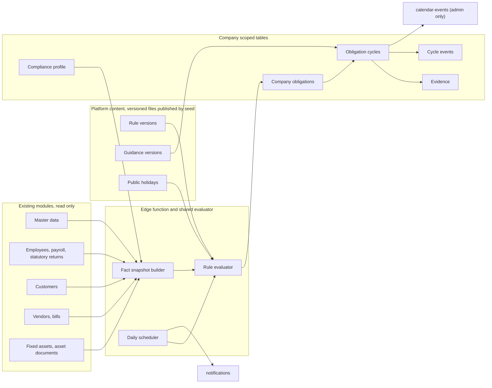

# Compliance & Governance — Principal Implementation Plan (Final)

**Status:** DEPLOYED to production 2026-10-02 and verified live (migration, both edge functions, 19 draft rules seeded with matching checksums, hourly scheduler running — first run: 2 companies, 22 reminders; security probe 12/12; browser journey green). Content remains DRAFT pending a named reviewer. Frontend visibility still needs the `VITE_COMPLIANCE_*` flags in Vercel. ADR-0004 proposed. Not certified.
**Date:** 2026-09-30 (revision 2, after review)
**Product:** AdminLess Fin (`adminless-fin`)
**Workspace:** `c:\Users\TebogoM\Desktop\development projects\SmartAccounting`

Source of truth is the current repo. Where the repo cannot answer a question, this document says **INVESTIGATION REQUIRED**.

## Revision 2 changes

- Added incorporation date and a fixed entity-type list to the questionnaire. Master data has neither, and the first rule (CIPC annual return) needs both.
- Added the business-day due-date rule and a South African public-holiday table to Phase 3.
- Split the data model into a per-company **obligation** (applicability, override, owner, reminders) and child **cycles** (filing periods or certificate renewals).
- Defined the precedence between user overrides and re-evaluation, and between rule-version changes and open cycles.
- Fixed two access leaks: calendar events and reminder recipients are restricted to owner/admin.
- Regulatory content is now written as versioned, checksummed files (same pattern as `src/statutory`) and published to tables by a seed script.
- Added source, reviewer, and review-due metadata to rules.
- Date signals are computed on the server in `Africa/Johannesburg`.
- Evidence uses server-issued signed upload URLs, row-id references, and soft delete only.
- Tests start in Phase 1. Database checks move into Phase 0.
- The pilot uses an email allowlist, like Financial Statements and Financial Close.
- Renamed the "compliant" status to "completed".

---

## Scope

Build a narrow, tenant-scoped **obligation workspace**. It watches data other modules already own, works out which obligations apply, tracks cycles and evidence, and sends reminders.

Out of scope: the full 13-domain Enterprise Governance & Compliance Platform (EGCP). [docs/enterprise-governance-compliance/V5.0.0/07_ENTERPRISE_READINESS_ASSESSMENT.md](../enterprise-governance-compliance/V5.0.0/07_ENTERPRISE_READINESS_ASSESSMENT.md) states that pack does **not** implement services, schema, Edge Functions, or UI. This module does not build delegation of authority, risk and control libraries, control testing, exception management, compliance scoring, or a second legislation repository.

Naming collisions to avoid:

- [src/governance/](../../src/governance/) is the company-admin foundation (financial calendar, company branding, master-data proxy, accounting policies, team security).
- `efs_company_master_data.governance` holds the company secretary, auditor, and accounting officer.

This module is neither of those. Its code lives in `src/compliance/` and `supabase/functions/compliance/`.

---

## 1. Current architecture findings

- **Stack.** Vite 6, React 18.3, `react-router-dom` 6, TanStack Query 5, `react-hook-form` + `zod` + `@hookform/resolvers`, shadcn/ui (Radix + Tailwind), `lucide-react`, Supabase JS. No Zustand, Redux, or Jotai.
- **Tooling.** `package.json` provides `typecheck`, `lint`, `test` (Vitest), `test:dom`, `test:integration`, and `guard:cfa`.
- **Shell.** [src/main.tsx](../../src/main.tsx) wraps the theme and runs `assertLegislationRepositoryValid()` from `src/statutory` at startup. [src/App.tsx](../../src/App.tsx) mounts `QueryClientProvider` → `BrowserRouter` → `AuthProvider` → `ReportingPeriodProvider` → `AppRouter`. Query defaults: 5 min stale, 30 min gc, retry 1, no refetch on focus.
- **Routes live in [src/router.tsx](../../src/router.tsx).** Pages are lazy-loaded. Guards:
  - `ProtectedRoute` — session and active company.
  - `AdminRoute` — `owner` or `admin`.
  - `AccountingReadyGate`, `FinancialStatementsGate`, `FinancialCloseGate`, `BetaAnalyticsRoute`.
- **Navigation.** [src/components/SidebarNav.tsx](../../src/components/SidebarNav.tsx), where `isAdmin = role === 'owner' || role === 'admin'`. Settings is reached from the admin-only header menu in `Layout.tsx`.
- **Auth.** [src/integrations/supabase/client.ts](../../src/integrations/supabase/client.ts) forbids `supabase.from()` in the frontend. Only `auth`, `functions.invoke`, and `storage` are allowed. A few violations remain elsewhere. [src/contexts/AuthContext.tsx](../../src/contexts/AuthContext.tsx) hydrates through the `user-session` edge function. `switchCompany` is the only path for changing company.
- **Roles.** `company_users.role` is one of `owner | admin | member`. There is no finer permission table. `GovernancePermissionBoundary` in [src/governance/types.ts](../../src/governance/types.ts) is declared but **not enforced** anywhere.
- **Edge tenancy.** `bootstrapTenantRequest` in [supabase/functions/_shared/enterpriseEdgePlatform.ts](../../supabase/functions/_shared/enterpriseEdgePlatform.ts) checks company membership, not role. Admin modules add a local `requireAdmin`. Writes go through the service-role client. Atomic write RPCs are service-role only.
- **RLS.** Policies use `is_company_member(company_id)` or a `company_users` join. `is_company_member` and `is_admin_of` are defined in the remote baseline, not in tracked migrations. The RLS on `notifications` also appears in no repo migration. **INVESTIGATION REQUIRED (Phase 0).**
- **Calendar.** `/calendar` sits outside `AdminRoute` (`src/router.tsx`). `supabase/functions/calendar-events/index.ts` checks membership only and already returns payroll run dates to members, even though Payroll is admin-only. That is an existing leak to log, not a pattern to copy.
- **Three existing "governance" layers, none of which is this product.**
  - `src/governance` — company-admin proxies behind [src/governance/featureFlags.ts](../../src/governance/featureFlags.ts). The `workflow`, `tax`, `currencies`, `auditConfiguration`, and `documentConfiguration` domains are `false` and throw if called.
  - Accounting Policy Engine and Accounting Rules Engine — Postgres, posting pipeline only. Integer `version`, company rules override system rules. No condition language and no effective dates.
  - Statutory payroll — immutable TypeScript per tax year under `src/statutory/`, with `effectiveFrom`, `effectiveTo`, `ruleVersion`, and a checksum. This is calculation law, not a filing calendar.
- **Company identity.** `companies` holds operational data (name, logo, invoice defaults, legacy `tax_id`). Legal identity is `efs_company_master_data`, typed in [src/lib/financialStatements/masterData/types.ts](../../src/lib/financialStatements/masterData/types.ts).
  - `CompanyProfileMaster` has `registered_name`, `trading_name`, `registration_number`, `nature_of_business`, `country_of_incorporation`, and `entity_type`.
  - `entity_type` and `nature_of_business` are free text.
  - There is **no incorporation date**, **no employee count**, and **no industry list**.
- **Onboarding** collects only the company name ([src/pages/CreateCompany.tsx](../../src/pages/CreateCompany.tsx)), then runs the accounting setup wizard ([src/pages/accounting/AccountingSetupWizard.tsx](../../src/pages/accounting/AccountingSetupWizard.tsx)). No questionnaire exists.
- **Documents.** The `attachments` bucket is **public** (`public: true` in `supabase/migrations/20260729150000_production_attachments_storage.sql`), with company-folder RLS.
  - Files are URL columns on bills, purchase orders, journals, expense claims, and loans.
  - `asset_documents` is the only document child table.
  - There are no employee, vendor, or customer document tables.
- **Notifications.** The `notifications` table has `user_id`, `company_id`, `content`, `link_to`, and `is_read`. [src/components/NotificationBell.tsx](../../src/components/NotificationBell.tsx) reads rows and subscribes to Realtime, but nothing in the repo inserts rows.
- **Tasks and schedules.** `ewm_tasks` have no due date, and `efcp_close_items` are financial-close checklist rows. The `recurring_*` tables are document-generation schedules processed by pg_cron. Those cron jobs are recorded in production evidence, not defined in repo migrations.
- **Audit.** Generic `audit_logs` are written by the `process_audit_log()` trigger and shown in Settings → Security. `settings` `GET_AUDIT_LOGS` checks membership only. `/audit-compliance-reports` is the VIP payroll working paper, not an obligation register.
- **Feature flags.** [src/lib/financialStatements/flags.ts](../../src/lib/financialStatements/flags.ts) and [src/lib/financialClose/flags.ts](../../src/lib/financialClose/flags.ts) define `VITE_*_MODULE`, `VITE_*_NAV_SIDEBAR`, and `VITE_*_ALLOWLIST`. Flags are fixed at build time and read through static `import.meta.env.VITE_*` only.
- **Freezes.** The Chart of Accounts (ADR-0001) and Canonical Financial Aggregation (ADR-0003) stay untouched.

## 2. Reuse

- **Routing.** Lazy route, `AdminRoute`, a sidebar group, and `VITE_COMPLIANCE_MODULE`, `VITE_COMPLIANCE_NAV_SIDEBAR`, `VITE_COMPLIANCE_ALLOWLIST` following the Financial Statements / Financial Close flag pattern. The allowlist makes a pilot possible without a rebuild per company.
- **Tenant key.** `useAuth().activeCompany.id` is the only tenant key. `ReportingPeriodContext` is not used.
- **Edge.** `bootstrapTenantRequest`, followed by an explicit owner/admin check in the new function.
- **Forms.**
  - `useForm` + `zodResolver` + shadcn `Form`.
  - [src/components/ui/form-dialog.tsx](../../src/components/ui/form-dialog.tsx) for dialogs.
  - [src/hooks/useFormPersistence.ts](../../src/hooks/useFormPersistence.ts) for the wizard, with the step in `?step=`.
- **Server state.** TanStack Query factories inside `src/compliance/`. Never add them to the [src/lib/queries.ts](../../src/lib/queries.ts) barrel (the sidebar had to stop importing it because it bloated the startup bundle).
- **Regulatory content.** Copy the `src/statutory` provenance pattern: typed files, checksums, effective dates, and startup/CI validation. Content lives as files and is published into tables by a seed script.
- **Delivery.** In-app reminders use the existing `notifications` table and `NotificationBell`, after Phase 0 verifies RLS. Email is deferred.
- **Calendar.** Add a read source inside `calendar-events`, gated by role.
- **Scheduling.** Copy the pg_cron + pg_net → edge function pattern used by `process-recurring-*`. Do not reuse those tables.
- **Facts.** Read master data through the existing readers. Deep-link gaps to `/settings?tab=master-data&module=...`.
- **Audit.** Attach `process_audit_log()` to the new tenant tables, and verify that `company_id` is resolved correctly.
- **Help UI.** Existing shadcn `Popover`, `Sheet`, or `DropdownMenu`.
- **Tests.** Vitest unit tests for the evaluator. `test:integration` for tenant and role isolation.

## 3. Do not duplicate

- Do not create a `src/governance` domain, and do not repurpose the dormant `workflow`, `tax`, or `documentConfiguration` flags.
- Do not fork payroll law out of `src/statutory/`. EMP201, IRP5, PAYE, UIF, and SDL stay in Payroll → Statutory Returns. Compliance may list them as obligations and reference a finalized `statutory_returns` row as evidence. It never recalculates them.
- Do not create employee, vendor, or customer document stores. Until those modules own documents, Compliance says where the document belongs.
- Do not reuse `efs_supporting_evidence`, `efcp_close_items`, `ewm_tasks`, the `recurring_*` tables, `messages`, or `accounting_rule_definitions`.
- Do not write questionnaire answers into `efs_company_master_data` or `companies`.
- Do not add a second notification bell, task system, or mailer.
- Do not evaluate rules in React, and do not ship rule conditions to the browser.
- Do not sum money (Canonical Financial Aggregation rule).

## 4. Architecture

- **UI.** Lazy `/compliance` routes inside `AdminRoute` plus a `ComplianceGate` (flag and allowlist). The sidebar group "Compliance & Governance" appears only when the nav flag is on and the user is an owner or admin. Everything is off by default.
- **Code layout.**
  - `src/compliance/` — pages, hooks, zod schemas, query keys.
  - `supabase/functions/compliance/` — tenant API.
  - `supabase/functions/compliance-scheduler/` — cron.
  - `supabase/functions/_shared/compliance/` — pure evaluator and date engine. The frontend must not import it.
  - `content/compliance/` — rule and guidance source files (fixed in Phase 0).
- **Evaluation runs on the server only**, triggered by profile save, manual refresh, and the daily scheduler. Results are materialized. The UI reads rows.
- **Industries and categories are data.** Core categories are Corporate & CIPC, Tax & SARS, Employment, Information & Privacy, B-BBEE, and General Governance. Industry packs are rule rows with an `industry_code`. Adding an industry never adds routes or components.
- **Jurisdiction.** Every rule has a `country_code`. v1 seeds `ZA` only.
- **First entry.** If the profile is not complete, `/compliance` opens the questionnaire. No other module changes.

## 5. Module integration map

Compliance only reads from other modules. In v1 it has no business-event subscribers. Facts are refreshed on profile save, manual refresh, and the daily run.

- **Master data.** Reads registration number, `entity_type` (for display), nature of business, addresses, tax numbers, directors, and officers. Gaps link to Settings.
- **Payroll.** Reads the active `employees` count, `payroll_runs` existence, `statutory_returns`, `payroll_enabled`, and the PAYE/SDL/UIF numbers. Evidence may reference a `statutory_returns` row id.
- **Purchases.** Reads vendor existence. Evidence may reference a `bills` or `purchase_orders` **row id**.
- **Sales.** Reads customer existence, used only as a personal-information hint.
- **Accounting.** Reads readiness facts: tax rates, VAT control mapping, financial year end. It never reads journal lines and never posts.
- **Assets.** Reads `fixed_assets` and `asset_documents`. Evidence may reference an `asset_documents` row id.
- **Banking, Inventory, Treasury.** Existence signals only. Evidence may reference a `loans` row id.
- **Financial Close and Financial Statements.** No shared tables in v1.
- **Operations calendar.** (Changed during build — see section 22.) The calendar page makes a separate, flag-gated `GET_CALENDAR` call to the `compliance` edge function, which refuses anyone but an owner or admin. `calendar-events` is not changed. If the compliance call fails, the calendar still shows everything else and says compliance dates could not be loaded. It is never a silent empty list.
- **Work Management and Chat.** No integration in v1.
- **Dependency direction.** Existing modules never import `src/compliance` or the compliance shared evaluator. Compliance calls only existing read paths.

## 6. Questionnaire

The questionnaire is not part of `/create-company` or `/accounting-setup`. It opens on first entry to `/compliance`.

**Derived facts** (not asked when known; shown as "already on file"):

- `registration_number` present.
- VAT: a `vat_number` present, or a `tax_rates` row. An empty value means **unknown**, not "not registered".
- Employees: active `employees` count, whether any `payroll_runs` exist, PAYE/SDL/UIF numbers, and `payroll_enabled`.
- Premises hint from master-data addresses.
- Existence of assets, inventory, and loans.
- Director count.
- Financial year end (from `financial_years`), used for tax due dates later.

**Always asked** (the data is missing or unreliable):

- **Incorporation or registration date** — needed for CIPC anniversary dates. Stored on the compliance profile.
- **Entity type from a fixed list**: private company, public company, close corporation, sole proprietor, partnership, trust, non-profit company, other. Master data `entity_type` is free text and is shown beside the answer.
- **Industry pack from a fixed list plus "other".** It is never inferred from `nature_of_business`.
- **Activities**: transport, food handling, security services, construction, childcare, and processing of personal information beyond ordinary invoicing.
- **Physical premises**, when no address is on file.
- **VAT status**, when no VAT number is on file: registered, not registered, or not sure. Choosing "registered" links to Master Data. The questionnaire does not write a VAT number.

**Storage.** Answers live on `compliance_profiles`, with a `questionnaire_version`. When answers conflict with master data, both values are shown with a link to Settings. Nothing is written back to master data.

**Form behaviour.** One zod schema per step, the step in `?step=`, and `useFormPersistence` so answers survive a refresh. The wizard must not remount if `activeCompany` is briefly null.

**Editing** increments the profile `revision` and re-runs evaluation. Cycle history is never deleted.

## 7. Rules engine

**Authoring.** Rules and guidance are written as typed files in the repo. Each carries:

- `code`, `version`, `status`, `country_code`, `category_code`, and `industry_code` (null for core rules).
- `effective_from` and `effective_to`.
- An `authority` code.
- Provenance: source URL, source retrieved date, reviewed by, last reviewed, review due.
- A checksum.

A Vitest suite and a CI script validate the schema, checksums, and non-overlapping effective dates, following the `assertLegislationRepositoryValid` pattern. A seed script publishes them to the platform tables. Published versions are immutable; a change is a new version. There is no in-app editor and no tenant authoring.

**Conditions.** A small JSON predicate, evaluated on the server against a closed set of facts:

- Facts: `has_employees`, `employee_count`, `vat_status`, `entity_type`, `industry_code`, `has_premises`, `activity_transport`, `activity_food`, `activity_security`, `activity_construction`, `activity_childcare`, `processes_personal_information`, `has_registration_number`, `incorporation_date_known`.
- Operators: `fact_eq`, `fact_in`, `fact_gt`, `fact_present`, `all_of`, `any_of`, `not`.
- An unknown or missing fact means the rule does not match, and the obligation is flagged "needs information". Nothing is inferred silently. No arbitrary code.

**Outcome.** A matched rule creates or updates one **company obligation**, holding category, authority, schedule type, evidence requirement, priority, default reminder offsets, and the guidance version.

**Due-date rules.**

- `anniversary_business_days` (for example, 30 business days after the incorporation anniversary). Uses the `compliance_public_holidays` table.
- `certificate_expiry` (an expiry date, optionally with a renewal lead time).
- Later phases: `annual_fixed_month_day`, `months_after_year_end`, `periodic` (monthly or bi-monthly). Each new type is an evaluator change with tests, not a content change. This is the known cost of Phase 6.

**Time zone.** All date maths runs in `Africa/Johannesburg`, on the server.

**Precedence.**

1. A user's "not applicable" override (owner or admin, with a reason) wins over re-evaluation until the facts behind that rule change. When they change, the obligation shows "your answer conflicts with new data". It is never silently reopened.
2. A new rule version:
   - Open cycles keep the rule version they started with.
   - New cycles use the new version.
   - Guidance wording may update on open cycles.
   - A due-date change applies only from the next cycle.
3. A retired rule: open cycles stay visible and are marked "rule retired". No new cycles are created.

**Evaluation log.** Each run records the profile revision, the rule versions considered, which matched, and a timestamp.

## 8. Obligation lifecycle

**Company obligation** (one per company per rule code):

- Applicability: `applicable`, `not_applicable`, or `needs_information`.
- Override flag, reason, who set it, and when.
- Responsible user and reminder offsets.
- Current rule version.

**Cycle** (child of an obligation):

- A filing period (`period_key`, `due_date`), or a certificate term (`valid_from`, `expiry_date`).
- `status`: `not_started`, `in_progress`, `evidence_submitted`, `completed`, or `action_required`.
  - "Completed" replaces "compliant", because the product should not assert legal compliance.
  - `under_review` is not in v1. There is no separate reviewer role.
- `completed_at` and `completed_by`.
- The rule and guidance version it was opened with.
- A "why it applies" snapshot.

**Recurring filings vs expiring certificates.**

- Completing a filing cycle opens the next one.
- Renewing a certificate closes the current term and opens a new term with a new expiry.

**Time signals.** `due_soon`, `overdue`, and `expired` are computed on the server in `Africa/Johannesburg` and returned with each row. The scheduler also stores them, so filters and reminders use the same values. The client does no date maths.

**Responsible user** must be a current owner or admin. If that person is removed or loses the role, the obligation falls back to all owners and records an event.

## 9. Evidence

- **Upload.** A compliance-owned file, such as a CIPC confirmation or a B-BBEE affidavit.
  1. The edge function checks that the cycle belongs to the caller's company and that the caller is owner or admin.
  2. It issues a signed upload URL to the private `compliance-evidence` bucket, path `{company_id}/{cycle_id}/{uuid}`.
  3. It records the metadata.

  Object keys are never overwritten. Files are read through short-lived signed URLs issued by the edge function.
- **Reference.** `source_table` + `source_id`, drawn from an allow-list: `asset_documents`, `statutory_returns`, `bills`, `purchase_orders`, `loans`. The edge function checks the source row belongs to the same `company_id`, and the display URL is resolved at read time. No copied URLs.
- Employee contracts, supplier SLAs, and customer contracts are not on the allow-list until their own modules store documents.
- **Deletion.** Soft delete only (`deleted_at`, `deleted_by`, reason), recorded in cycle events. Hard purge follows a retention policy (open decision; POPIA).
- **Metadata.** Title, kind, uploaded by, created at, cycle id, `company_id`. No file contents in logs or audit rows.

## 10. Reminders

- **Offsets.** Rule defaults (for example 30, 7, and 1 days), adjustable per obligation from the allowed set.
- **Scheduler.** `compliance-scheduler`, triggered by pg_cron + pg_net once a day, gated by `requireServiceRole`.
  - Processes only companies with a completed profile, in pages of a fixed size.
  - Keeps a resume cursor so a timeout never repeats or skips a batch.
  - Re-evaluates facts, refreshes time signals, and opens next cycles.
- **Idempotency.** `compliance_reminder_dispatches`, unique on `(cycle_id, offset_days, channel, recipient_user_id)`. The dispatch row and its `notifications` row are written in one transaction (a service-role RPC), so a timeout can never leave a reminder recorded as sent but not delivered, or delivered twice. With the owner fallback, each owner is a separate dispatch. Overdue reminders are sent once per cycle, not daily.
- **Recipient check at send time.** `company_users` has no status column; removing a person deletes the row, and demotion changes `role`. The scheduler therefore checks the responsible user's role at send time (the same test as `is_admin_of`) rather than relying on a foreign key, and falls back to the owners when it fails.
- **Delivery.** A row in the existing `notifications` table for the responsible owner or admin (or the owners, as the fallback), with `link_to` set to `/compliance/obligations/:id`. The bell needs no change once Phase 0 confirms RLS.
- **Calendar.** Admin-only event types in `calendar-events`.
- **Email** is deferred. The existing senders are document emails, not general notifications.
- **Deployment.** The cron job is recorded in deployment docs, the same way current jobs are. No invented migration filenames.

## 11. Educational content

Guidance files are versioned alongside the rules. Fields:

- `what_is_this`, `why_it_matters`.
- `how_to_comply` (ordered steps).
- `documents_needed`, `if_you_dont`.
- `where_to_complete` (label and external URL).
- `disclaimer`.

The UI shows guidance from an info or ellipsis control on each obligation, in a popover or sheet fed by the API. No regulatory text lives in components.

Every guidance item says it is educational and not legal advice. v1 does not file with CIPC or SARS.

Each rule's `review_due` date feeds an internal "stale content" report, run in CI or on demand.

## 12. Conceptual data model

Table names are proposals; ownership and tenancy are fixed.

**Platform tables** (no `company_id`). RLS on with **no** policies (changed during build): rule conditions never reach the browser, so only the edge functions read them, with the service role. Only the seed SQL writes.

- `compliance_authorities` — code, name, country, website.
- `compliance_categories` — the six core categories.
- `compliance_industries` — code, name, active.
- `compliance_rule_versions` — code, version, status, country, category, industry, authority, condition JSON, schedule JSON, evidence requirement, priority, reminder defaults, effective dates, provenance, checksum.
- `compliance_guidance_versions` — foreign key to the rule version, the help fields, checksum.
- `compliance_public_holidays` — country, date, name.

**Tenant tables** (`company_id` NOT NULL, foreign key to `companies`). RLS allows SELECT for the company's owners and admins. There are no INSERT, UPDATE, or DELETE policies for `authenticated`; all writes go through the edge function using the service role.

- `compliance_profiles` — unique `company_id`, status, `completed_at`, `questionnaire_version`, `revision`, answers JSON, last fact snapshot JSON.
- `compliance_evaluation_runs` — profile revision, rule versions considered, matched codes, `ran_at`.
- `compliance_obligations` — unique `(company_id, rule_code)`, applicability, override fields, `responsible_user_id`, reminder offsets, current rule version.
- `compliance_obligation_cycles` — obligation id, `period_key` or term dates, `due_date`, `expiry_date`, status, time signal, completion fields, rule and guidance versions. Unique `(obligation_id, period_key)`.
- `compliance_cycle_events` — append-only history: actor, event type, before and after, rule version.
- `compliance_evidence` — cycle id, kind, storage key or source reference, metadata, soft-delete fields.
- `compliance_reminder_dispatches` — unique `(cycle_id, offset_days, channel, recipient_user_id)`, `notification_id`, and `sent_at`.

**Indexes.**

- `(company_id)` on every tenant table.
- `(company_id, due_date)` and `(company_id, expiry_date)` on cycles.
- `(company_id, applicability)` on obligations.
- The unique keys listed above.

**Not in v1:** a question content system, company-editable rules, and task tables.

After each migration, regenerate `src/integrations/supabase/database.types.ts`.

## 13. Security model

- **Isolation.**
  - `company_id` comes from the bootstrapped request context, never trusted from the request body alone.
  - Every service-role query filters by it.
  - Every evidence reference and responsible-user assignment is checked against the same company.
- **Roles.**
  - v1 is owner and admin only, enforced in the edge function and not only in `AdminRoute`.
  - Members get no nav entry, no route, no calendar events, and no reminders.
  - Nobody in a tenant can edit or publish rules.
- **Actions** open to owners and admins: view, answer the questionnaire, upload or reference evidence, set dates, mark completed, mark not applicable (reason required), and assign the responsible user. Every action writes a cycle event, and the `audit_logs` trigger covers the tenant tables.
- **Storage.** A private `compliance-evidence` bucket, with MIME and size limits, server-issued signed URLs only, and no upsert. The public `attachments` bucket is never used.
- **Existing weaknesses to log and not repeat.**
  - The public `attachments` bucket.
  - Role checks that only check membership (the earlier Banking defect, the `calendar-events` payroll dates, and `settings` `GET_AUDIT_LOGS`).
  - Remaining frontend `supabase.from()` calls.
  - The unenforced `GovernancePermissionBoundary`.
  - Service-role cross-tenant risk.

  Fixing the existing calendar payroll leak and the audit-log gap is a separate bug fix, not part of this module.

## 14. Performance and stability

- Lazy routes, so a build with the flag off never downloads the module.
- A static sidebar link list, with no prefetch from the sidebar and no import of the `queries.ts` barrel.
- One company-scoped list query for the dashboard. Counts come back grouped from the edge function.
- No polling. Mutations invalidate the cycle and obligation queries.
- Facts are built from `count` and `exists` reads, never full lists.
- The evaluator is a pure function, with no I/O inside rule evaluation.
- The scheduler pages through companies, can resume, and is idempotent.
- The wizard survives refreshes and company re-hydration. Switching company clears compliance queries through the existing `switchCompany` path.
- Nothing is added to Financial Statements, Trial Balance, or dashboard loaders.

## 15. Migration and backward compatibility

- Purely additive: new tables, a new private bucket, new edge functions, one guarded read source in `calendar-events`.
- No column changes to `companies`, `employees`, `vendors`, `customers`, `fixed_assets`, or `efs_company_master_data`.
- Existing RLS is untouched, apart from a verified, separate change to `notifications` if Phase 0 shows one is needed.
- The flag is off by default. With it off, the sidebar entry, routes, calendar events, and scheduler are all inactive.
- A compliance profile is created on the first admin visit, never at company creation. Existing users are never prompted.
- No changes to onboarding, auth, the Chart of Accounts, posting, Canonical Financial Aggregation, payroll calculation, Financial Statements, or Financial Close. `guard:cfa` must stay green.

## 16. Implementation phases

- **Phase 0 — Checks and ADR.**
  - Read the live definitions of `is_company_member`, `is_admin_of`, the RLS on `notifications`, and the `process_audit_log()` company attribution.
  - Confirm the production bucket settings and the Edge Function time limit.
  - Fix the content folder name.
  - Write ADR-0004 recording the scope, the module location, admin-only v1, the private bucket, file-based content, and no write-back to master data.
- **Phase 1 — Shell.**
  - Flags and allowlist, `ComplianceGate`, lazy routes, an empty home page.
  - The `compliance` edge function with bootstrap and owner/admin check. Platform and tenant tables (empty). Regenerate types.
  - Integration tests: a member is rejected; a foreign `company_id` is rejected.
- **Phase 2 — Profile.** Questionnaire, fact builder, persistence, deep links to Master Data. Unit tests for fact derivation.
- **Phase 3 — First rule, end to end.**
  - The CIPC annual return rule and its guidance as content files.
  - Content validation, the seed script, the SA public-holiday data.
  - The `anniversary_business_days` due-date engine with unit tests.
  - Evaluator, obligation and cycle materialization, the obligation screen with guidance, override, history, and completion.
- **Phase 4 — Evidence.** Private bucket, signed upload and download, soft delete, and the reference allow-list (at least `statutory_returns` and `asset_documents`). Storage privacy tests.
- **Phase 5 — Reminders.** Scheduler (paged, resumable, idempotent), `notifications` writes, the owner fallback, the admin-only calendar source. Tests for idempotency and time zone.
- **Phase 6 — Core categories.**
  - Add the remaining due-date types (`certificate_expiry`, `months_after_year_end`, `periodic`) with tests.
  - Then publish Tax & SARS, Employment, Information & Privacy, B-BBEE, and General Governance rules.
  - Employment obligations reference payroll records and never calculate.
- **Phase 7 — Industry packs.** One pack end to end, then the rest as content only.
- **Phase 8 — Release checks.**
  - The full regression suite.
  - A bundle check that a flag-off build excludes the module.
  - `guard:cfa`, `typecheck`, `lint`.
  - Calendar and notification-bell regression.
  - The stale-content report.

Each phase ends with `typecheck`, `lint`, `test`, and the relevant `test:integration` suites. Security tests are written in the phase that adds the capability, not saved for the end.

## 17. Risk register

**Critical**

- **Evidence stored in the public bucket.** Tax and identity documents would be readable by URL.
  - Mitigation: a private bucket with signed URLs issued by the server.
- **Service-role cross-tenant access.** The edge function bypasses RLS.
  - Mitigation: `company_id` from context only, same-company checks on references and assignees, and integration tests.

**High**

- **Missing role check in the edge function.** Banking shipped with membership checks only.
  - Mitigation: an owner/admin check in every method, plus a member-rejection test.
- **Compliance dates leaking to members through `/calendar`.** The endpoint checks membership only.
  - Mitigation: a role gate inside `calendar-events` for compliance events.
- **Reminders sent to users who cannot open the module.**
  - Mitigation: responsible user must be owner or admin, with fallback to owners.
- **First rule blocked by missing data.** There is no incorporation date and no business-day logic.
  - Mitigation: the questionnaire asks for the date, and the holiday table and date engine are in Phase 3.
- **Wrong obligations from free-text entity type or industry.**
  - Mitigation: fixed lists in the questionnaire, no inference, and "needs information" when unknown.
- **Re-evaluation undoing a user's decision.**
  - Mitigation: the precedence rules, and conflicts are shown rather than silently reopened.
- **Rule change rewriting history.**
  - Mitigation: cycles pin the rule version, and changes apply to the next cycle.
- **Duplicate document stores.**
  - Mitigation: the reference allow-list, and no new HR, vendor, or customer document tables.
- **Questionnaire overwriting legal identity.**
  - Mitigation: no write-back to master data.
- **Rules evaluated in the browser, or conditions exposed to it.**
  - Mitigation: the shared evaluator lives in edge code only.
- **Collision with `src/governance` or the EGCP documents.**
  - Mitigation: a separate folder and ADR-0004.
- **Stale or wrong regulatory content.**
  - Mitigation: provenance, review-due dates, the stale-content report, "completed" wording, and the disclaimer.
- **Canonical Financial Aggregation or Chart of Accounts side effects.**
  - Mitigation: no money aggregation and no account-role changes. `guard:cfa`.

**Medium**

- **Unknown `notifications` RLS or helper-function definitions.**
  - Mitigation: Phase 0 checks.
- **Scheduler timeouts at scale.**
  - Mitigation: paging, a resume cursor, idempotent dispatch.
- **Time-zone mismatch between the badge and the reminder.**
  - Mitigation: the server computes signals in `Africa/Johannesburg`.
- **Audit trigger misattributing company.**
  - Mitigation: verified in Phase 0 and tested in Phase 1.
- **Startup bundle regression.**
  - Mitigation: lazy routes, no barrel import, the bundle check.
- **Wizard losing answers when company data re-hydrates.**
  - Mitigation: `useFormPersistence`, and no changes to AuthContext.
- **Evidence retention and POPIA.**
  - Mitigation: soft delete now, with the retention policy as an open decision.

## 18. Recommended order

Phase 0 → 1 → 2 → 3 → 4 → 5, then 6 → 7 → 8.

- Do not widen content before the first rule passes the security and date tests.
- Reminders come after evidence, so every reminder links to a real, completable cycle.
- Industry packs come last because, once the engine exists, they are content.

## 19. Definition of done

- An admin of company A completes the questionnaire and sees only matching obligations. Nothing from company B is visible through the UI, API, storage, calendar, or notifications.
- A member of company A is refused by the route, the edge function, and the calendar, and receives no reminders.
- The CIPC annual return rule:
  - Computes a business-day due date from the incorporation anniversary, in `Africa/Johannesburg`.
  - Shows guidance loaded from published content.
  - Accepts a private upload.
  - Records completion and opens the next cycle, keeping history.
- A certificate-type obligation expires and renews by term, without using filing periods.
- A user's "not applicable" survives re-evaluation until the facts change, and then shows a conflict.
- Publishing a new rule version leaves open cycles on their original version.
- A statutory-return or asset-document reference opens the source record, and no file is copied.
- Reminders are sent exactly once per offset and go only to owners or admins.
- Master data, onboarding, and all existing modules behave as before.
- With the flag off, the module is not in the bundle, the nav, the routes, the calendar, or the scheduler.
- `typecheck`, `lint`, `test`, the relevant `test:integration` suites, and `guard:cfa` all pass. The compliance UI makes no `supabase.from()` calls.

## 20. Decisions

**Adopted (recorded in ADR-0004 in Phase 0):**

1. Narrow scope. No full EGCP.
2. Owner/admin only in v1.
3. A private `compliance-evidence` bucket. Never the public `attachments` bucket.
4. Rules and guidance are versioned files published by seed. No in-app editor.
5. No write-back from the questionnaire to master data.
6. Questions live in app code with a `questionnaire_version`. Rules and guidance live in content.
7. Users may mark an obligation not applicable, with a reason, an event, and the precedence rules above.
8. Status wording is "completed", not "compliant".
9. The first rule is the CIPC annual return, with incorporation date and business-day logic.

**Open, but not blocking Phases 0 to 2:**

- **Evidence retention period and purge policy** (POPIA). Needed before Phase 4 ships.
- **Who reviews and signs off regulatory content** (a named owner for `reviewed_by`). Needed before Phase 3 content is published.
- **First industry pack.** Needed before Phase 7.
- **Whether members get read-only access later.** Deferred; it would need a new decision.

**Phase 0 investigation:** complete. See section 21.

## 21. Phase 0 findings (2026-09-30)

These were read-only catalog queries against the linked production project "Smart Accounting" (`zaulhnpohrgqqodvzhxp`) using `supabase db query --linked`. Nothing was changed.

**Permission helpers.** Both exist and are safe to use in new RLS policies.

- `public.is_company_member(p_company_id uuid)` — `SECURITY DEFINER`, `search_path = public`. True when a `company_users` row exists for `auth.uid()`.
- `public.is_admin_of(p_company_id uuid)` — `SECURITY DEFINER`, `search_path = public`. True when that row's role is `owner` or `admin`.
- Decision: tenant compliance tables use `is_admin_of(company_id)` for SELECT, with no write policies for `authenticated`.
- `company_users` has only `company_id`, `user_id`, `role`. No status column: removal deletes the row. Roles in use today are `owner` and `member`; no company has an `admin` yet, so v1 is owner-only in practice.

**Audit trigger.** `public.process_audit_log()` takes the company from a `company_id` column, so a compliance table with `company_id` needs no change to the function. The trigger is attached per table, so each new tenant table must attach it explicitly in its migration (section 2).

- It records `changed_by = auth.uid()`. That is **NULL** for writes made by an Edge Function using the service role. Decision: `compliance_cycle_events` stores `actor_user_id` explicitly, and it is the authoritative history. `audit_logs` is supporting forensics only.
- It copies full old and new rows into `audit_logs`. Compliance rows must never hold file contents or secrets.
- `audit_logs` SELECT is limited to owner/admin by the policy "Admins can view audit logs". The membership-only gap is in the `settings` edge method, not in RLS.

**Notifications.** Usable as the reminder sink with no RLS change.

- RLS is on. SELECT policy "Users can only see their own notifications" (`auth.uid() = user_id`). UPDATE policy "Users can update their own notifications".
- There is no INSERT or DELETE policy, so RLS refuses those for `authenticated` (the table-level grants are the Supabase default and do not bypass RLS). Only the service role can create rows. That matches the scheduler design.
- Columns are `id`, `created_at`, `user_id`, `company_id`, `content`, `link_to`, `is_read`. There is no type or dedupe key, so reminder idempotency lives in `compliance_reminder_dispatches`, and `content` must be self-contained plain text.
- `notifications` is in the `supabase_realtime` publication.
- `NotificationBell.tsx` filters by `user_id` and `active company_id`. A reminder for company A does not appear while the user is in company B.

**Storage buckets (live).**

- `attachments` — public, 50 MB limit, MIME allow-list.
- `avatars` — public, no size or MIME limit. This is a new weakness, not in repo migrations.
- `chat_attachments` — private.
- Decision confirmed: create a new private `compliance-evidence` bucket in Phase 4.

**Cron (live).** `prod-process-recurring-bills-hourly`, `prod-process-recurring-entries-hourly`, `prod-process-recurring-invoices-hourly`, `prod-run-depreciation-daily`. No compliance job yet; one daily job is added in Phase 5.

**Edge Function limits** (from [Supabase docs](https://supabase.com/docs/guides/functions/limits)):

- 150 s wall clock on the free plan, 400 s on paid plans.
- 150 s request idle timeout.
- **2 s CPU per request**.
- 256 MB memory.
- 100 functions on the free plan. The repo has 62, so two new functions fit.

`docs/rc1/KNOWN_ISSUES.md` records the project as being on the free plan. Decisions:

- The scheduler processes a small fixed page of companies per invocation (start at 25) and stores a cursor.
- Evaluation must stay a cheap pure function, well inside the CPU budget.
- Page size is tuned in Phase 5 from measured CPU time.

**Content folder.** Fixed as `content/compliance/`, organised by country, then category or industry, then rule code.

- Validated by `tests/unit/compliance-content.test.ts`.
- Published by `scripts/complianceContentSeed.ts`.
- Kept outside `src/` so rule conditions are never bundled into the browser.

**ADR.** [docs/adr/ADR-0004-compliance-governance-module-boundaries.md](../adr/ADR-0004-compliance-governance-module-boundaries.md), status PROPOSED until the owner signs it off.

**New or confirmed existing weaknesses** (to fix separately, outside this module):

- `calendar-events` returns payroll run dates to members (membership check only).
- `settings` `GET_AUDIT_LOGS` checks membership only. RLS would block direct reads, but the Edge Function uses the service role.
- `avatars` bucket is public with no size or MIME limit.
- `notifications` UPDATE policy has no `WITH CHECK`, so `USING` is applied to the new row: a user can edit the text, link, or company of their own notifications, but cannot hand one to another user. Low risk (self only).

**Re-verified** by a second read-only catalog query on 2026-09-30 during plan review. Every finding above matched the live database. No compliance tables or objects exist yet.

## 22. Build status and deployment (2026-09-30)

### What was built

| Area | Where |
| --- | --- |
| Engine (pure, server-only): conditions, date engine, schedules, materializer, actions, signals, access, facts | `supabase/functions/_shared/compliance/` |
| Data access and the single change path (read → act → materialize → one transactional RPC, retried on concurrent change) | `_shared/compliance/store.ts`, `service.ts` |
| Tenant API (owner/admin only, every method) | `supabase/functions/compliance/` |
| Daily scheduler (service role only, paged, resumable, exactly-once reminders) | `supabase/functions/compliance-scheduler/` |
| Schema, private bucket, RPCs | `supabase/migrations/20261001100000_compliance_governance_module.sql` |
| Content: 19 South African rules with guidance, 7 categories, 13 industries, 9 authorities, public holidays 2025–2030 | `content/compliance/`, lock in `checksums.lock.json` |
| Validate / relock / publish content | `npm run compliance:content -- --check \| --update-lock \| --sql [--include-drafts]` |
| UI: questionnaire, obligations, obligation detail (guidance, periods, proof, history, override, responsible person, reminders, certificate terms) | `src/compliance/` |
| Calendar adapter | `src/compliance/calendarSource.ts`, used by `src/pages/FinancialCalendar.tsx` |
| Tests | `tests/unit/compliance-engine.test.ts`, `tests/unit/compliance-content.test.ts`, `tests/integration/compliance-isolation.test.ts`, `tests/e2e/playwright/20-compliance.spec.ts`, live probe `tools/compliance/probe-compliance-live.ts` |

Rules shipped (19, all **draft**, awaiting a named reviewer): CIPC annual return; beneficial ownership; VAT201; EMP201; EMP501 interim and annual; ITR14; provisional tax (both payments); Compensation Fund return of earnings; letter of good standing (certificate); EEA2/EEA4; Information Officer registration (once-off); B-BBEE certificate (certificate); annual financial statements; and the first activity pack (Phase 7) in `content/compliance/za/activities.ts` — PSIRA registration, food-premises Certificate of Acceptability, CIDB contractor registration, early childhood development registration. The pack is keyed on the questionnaire's activity answers rather than one industry code, so a business gets every rule that fits what it does; industry-coded packs remain supported.

### Deviations from the plan, and why

- **Calendar.** Compliance dates come from a separate `GET_CALENDAR` call to the `compliance` function, not from a new source inside `calendar-events`. No existing edge function changes; the owner/admin check is the compliance function's own; a failure shows its own notice without affecting the rest of the calendar.
- **Platform tables have no SELECT policy** for `authenticated` (the plan allowed reading published rows). Reading them through REST would expose rule conditions; the API returns everything the UI needs.
- **Checksums** live in `content/compliance/checksums.lock.json` rather than inside each rule, so editing a draft does not mean hand-editing a hash. Published entries can never be relocked.
- **A cycle status `cancelled`** ("withdrawn") was added: a period is withdrawn, never deleted, when an obligation stops applying or an anchor date is corrected.
- **Schedule types** `once_off` and `periodic` with `from_vat_filing_frequency` were added; the questionnaire asks the VAT filing frequency when the company is VAT-registered.
- **The allowlist narrows** the pilot; it never grants access to a member (unlike the Financial Close allowlist).

### Verified before deploy

- Typecheck, lint (0 errors), strict `tsc` of the engine/content/seed, esbuild bundle of both edge functions, 1350 unit tests, 15 integration tests, `guard:cfa`, production build (the three pages are separate lazy chunks).
- **Live rehearsal** of the migration in a transaction that always aborts: plan RPC applies and converts arrays; stale state and cross-company rows refused; reminder sent exactly once; a member refused as a recipient; history cannot be updated or deleted; published rules immutable; bucket private; `authenticated` cannot call the RPC or write the tables; audit trail written.
- **Live rehearsal** of the content seed, run twice in one aborting transaction: 15 rules, 15 guidance, 79 holidays, no duplicates.

### Deployment runbook (run 2026-09-30, except steps 4b, 5 and 6)

1. `npx supabase db push --linked --yes` — applies `20261001100000`. **Done.**
2. `npx supabase functions deploy compliance compliance-scheduler --project-ref zaulhnpohrgqqodvzhxp`. **Done.**
3. Publish content. In Windows PowerShell `npm run ... -- --sql` loses the flags and npm's banner lands in the file, so call the script directly and write without a BOM:
   `npx --yes tsx scripts/complianceContentSeed.ts --sql --include-drafts` (drop `--include-drafts` for reviewed rules only), save the output as UTF-8 without BOM, then `npx supabase db query --linked -f seed.sql`. **Done** with drafts: 19 rules (all `reviewed = false`), 19 guidance, 79 holidays, 7 categories, 13 industries, 9 authorities; `compliance-evidence` bucket private.
4. Scheduler job. **Done:** job `prod-compliance-scheduler-hourly`, `40 * * * *`. The job reads the key from Supabase Vault at run time, so the key is never in SQL, the repo or `cron.job`:
   `headers := jsonb_build_object('Content-Type','application/json','Authorization','Bearer ' || (SELECT decrypted_secret FROM vault.decrypted_secrets WHERE name = 'service_role_key'))`.
   It runs hourly so a day's run can continue from its cursor; after the day finishes, each call returns at once.
   4b. **Owner action:** create the secret once in the SQL editor: `select vault.create_secret('<service role key>', 'service_role_key', 'pg_cron to Edge Functions');`. Until then every call returns 401 (check `select status_code, created from net._http_response order by created desc limit 5;`).
5. `npx supabase gen types typescript --linked > src/integrations/supabase/database.types.ts` (the UI does not read these tables, so this is housekeeping).
6. **Owner action:** enable the pilot: `VITE_COMPLIANCE_MODULE=true`, `VITE_COMPLIANCE_NAV_SIDEBAR=true`, and `VITE_COMPLIANCE_ALLOWLIST=<pilot emails>` in the Vercel environment, then redeploy.
7. Verify. **Done:** the live probe passed 12/12 (the plain-member check was skipped because the E2E user is not a plain member of any company). With the flags on, `npx playwright test 20-compliance --project=chromium-desktop` passed 4/4 on three runs in a row; the test now reopens earlier completions first, so it can be repeated on the same company.

### Found during deployment: recurring invoices and bills never ran on schedule

The existing jobs send the **anon** key. Depreciation (job 5) and recurring journals (job 6) still work, because `system` functions only log an unrecognised key. Recurring invoices (job 7) and recurring bills (job 8) returned 401 on every run: both functions accepted only a signed-in user and one `company_id` per call, so a scheduled call could never succeed, whatever the key.

Fixed 2026-10-01 (owner approved):
- Both functions now have a scheduler path. It is taken only when the bearer token equals the service-role key exactly, and only for `PROCESS_DUE`; it runs the due profiles of every company. The signed-in path is unchanged.
- Each profile run is claimed (its `next_run_date` moves on, conditionally) before the invoice or bill is posted, so a scheduled run and a manual run cannot post the same period twice; the claim is undone if posting fails.
- Jobs 7 and 8 read the key from the vault, like job 9. They start working once step 4b is done. Jobs 5 and 6 were left on their current key because they work; move them to the vault after step 4b if wanted.

### Still open

- **Content review** (decision): every rule is a draft until a named reviewer signs it off; a reviewed text becomes version 2.
- **Evidence retention and purge** (decision, POPIA): only soft delete exists; nothing is purged.
- **ADR-0004** is still PROPOSED.
- **Deployment**: steps 4b and 6 are owner actions; step 5 is optional.
- **Ad hoc public holidays** (e.g. election days) must be added to the content when gazetted.
- **Email reminders** are deferred; reminders are in-app only.
- Existing weaknesses from section 21 remain for separate fixes.
