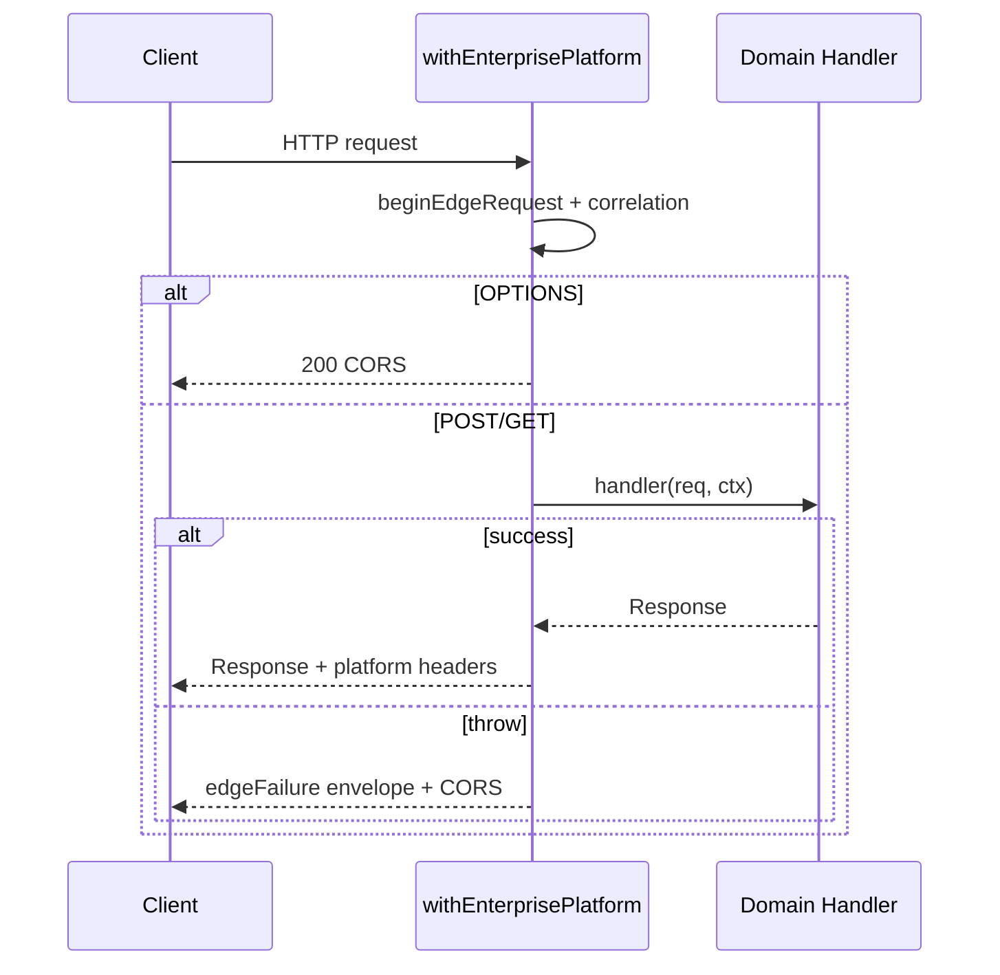

# 02 — Request Lifecycle Specification

**Version:** 4.2.1  
**Status:** CERTIFIED  

---

## Lifecycle (ordered)

```
1. beginEdgeRequest          → correlationId, startedAt, structured log request.start
2. OPTIONS?                  → optionsResponse (200 + CORS + correlation) → END
3. handler(req, ctx)         → domain logic
4a. success Response         → inject CORS + correlation + platform headers → log request.success
4b. thrown error             → edgeFailure → platform envelope + CORS → log request.failure
```

No authentication, database, environment business use, validation, or routing may run before step 2 completes for OPTIONS.

---

## Pipeline Detail

| Step | Responsibility | Module |
|------|----------------|--------|
| Correlation resolve | Header `x-correlation-id` / `x-request-id` or generate | `resolveCorrelationId` |
| OPTIONS | Identical across fleet | `optionsResponse` |
| Auth | Mode-specific | Auth Standard |
| Company resolution | `company_id` + `company_users` | `requireCompanyMembership` / inline equivalent |
| Permission | Membership gate (tenant) | same |
| Request validation | Domain throws → classified | Domain + `classifyFromMessage` |
| Business routing | Domain `switch(method)` | Unchanged |
| Response generation | JSON + headers | Wrapper / `edgeSuccess` |
| Structured errors | Envelope | `edgeFailure` / `platformErrorResponse` |
| Logging | JSON stdout | `platformLog` / `platformLogError` |
| Audit context | correlationId, companyId, userId, functionName | Log fields + response headers |
| Rate-limit readiness | Observe buckets | `ratelimit.observe` |
| Performance metrics | `elapsedMs` on every log | `platformLog` |

---

## Sequence



---

## Timeout Behaviour

- Domain/network timeouts surface as thrown errors.
- Classifier maps timeout language → `TimeoutError` (retryable).
- Wrapper **always** returns an HTTP response; the isolate must not terminate without CORS.
