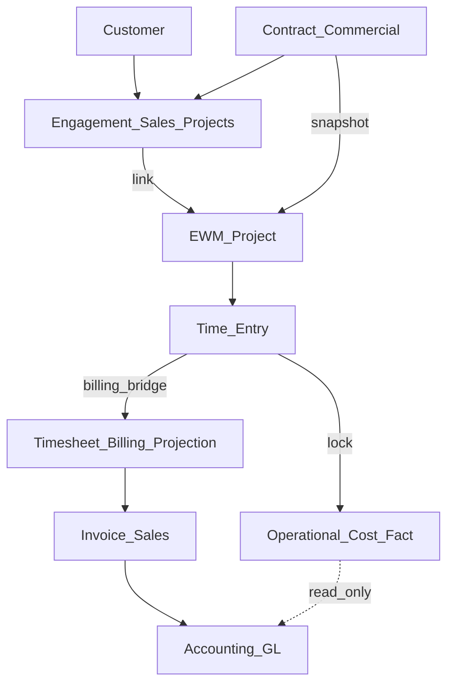

# 02 — Domain Relationship Report

**Version:** 4.1.1  
**Board:** Independent Principal Enterprise Domain Architecture Board  

---

## 1. Canonical Hierarchy

```
Company
  └── Workspace
        └── Portfolio
              ├── Initiative (strategic link)
              ├── Programme (optional)
              │     └── Project  [stereotype: Job]
              │           ├── Contract snapshot (from Sales/Engagement)
              │           ├── Phase*
              │           │     └── Milestone*
              │           │           └── Task*
              │           │                 ├── Subtask*
              │           │                 ├── Checklist*
              │           │                 └── Time Entry
              │           ├── Deliverable*
              │           ├── Assignment*
              │           ├── Budget / Forecast / Operational Cost
              │           ├── Risk / Issue / Decision / Dependency
              │           └── Document* / Photo* (refs)
              └── Project (direct, if no Programme)
```

`*` = optional by industry template.

---

## 2. Commercial vs Operational Split



| Concept | SoT |
|---------|-----|
| Customer | CRM |
| Engagement / billable project | Projects/Sales |
| Contract master / variations | Sales/CRM (or Engagement) |
| Operational delivery Project | EWM |
| Recognised revenue / journals | Accounting |
| Payslips / PAYE | Payroll |

---

## 3. Resource Relationship

```
Resource Type (catalogue)
  └── Work Resource (company instance)
        ├── optional link → Employee | Vendor | Asset | Product
        ├── Assignment → Project / Task
        ├── Clock Session (people types)
        ├── Time Entry (effort)
        └── Resource Consumption → Operational Cost (non-labour / certified)
```

---

## 4. Time Capture Relationship

```
Shift ──used_by──► Roster ──feeds──► Capacity Plan
                         │
Clock Session ──closes──► Time Entry (draft) ──approve/lock──► Operational Cost
                                      │
                                      ├──► Payroll Input Fact (eligible types only)
                                      └──► Timesheet projection (billable)
```

---

## 5. Forbidden Relationships

| Forbidden | Reason |
|-----------|--------|
| Work Resource (subcontractor) → Payroll Input Fact (ready) | AP only |
| Time Entry → Journal Entry (direct post) | Accounting owns posting |
| EWM Forecast Margin → replace GL Net Profit | Dual authority forbidden |
| Job entity parallel to Project | Stereotype only |
| Revenue Recognition entity inside EWM | Accounting-owned |
| Duplicate Approval engine per object family | One workflow pattern |

---

## 6. Cardinality Highlights

| From | To | Cardinality |
|------|----|-------------|
| Workspace | Portfolio | 1:N |
| Portfolio | Programme | 0:N |
| Programme/Portfolio | Project | 1:N |
| Project | Phase | 0:N |
| Task | Time Entry | 1:N |
| Clock Session | Time Entry | 0..1 : 0..1 on close |
| Work Resource | Assignment | 1:N |
| Project | Operational Cost | 1:N |
| Engagement | EWM Project | 0..1 : 0..1 preferred (1 Engagement may link 1 EWM Project initially) |

**Board note:** Multi-EWM-Project per Engagement may be allowed later for multi-site jobs; cardinality must be declared in Implementation Approval if expanded.
