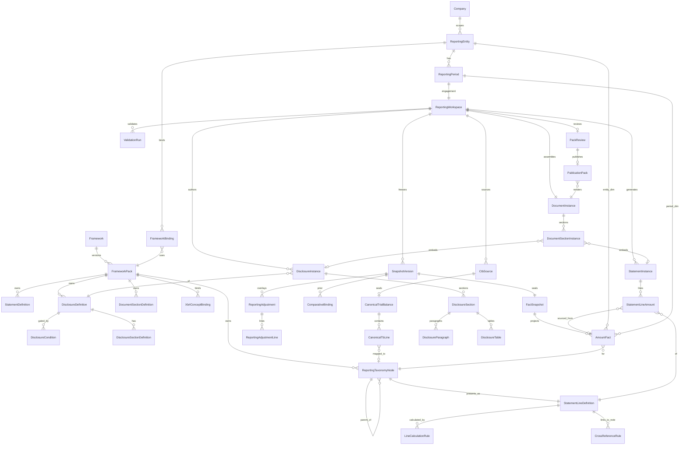
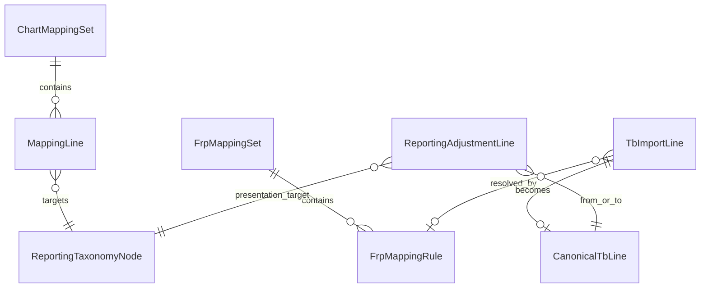
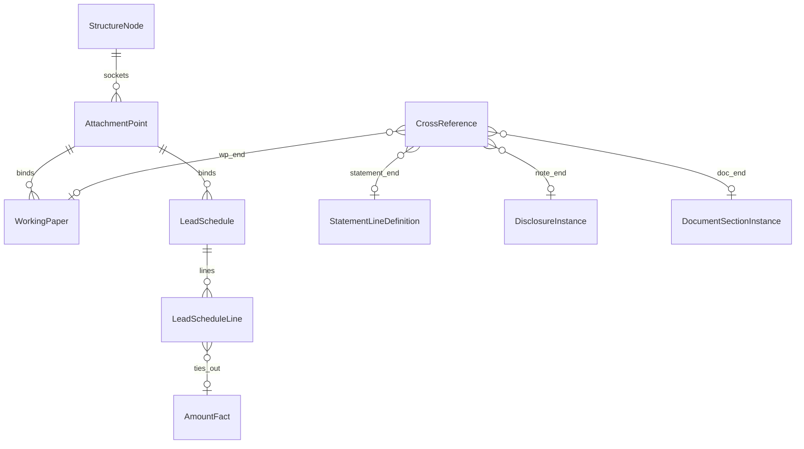
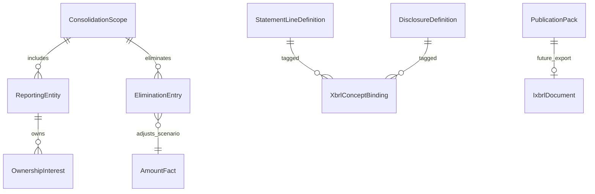

# 02 — Entity Relationship Diagram

**Version:** 7.1.0  
**Notation:** Logical ERD (Crow’s Foot). Physical table names may use `efs_` / `frdm_` prefixes per migration strategy.

---

## 1. Core reporting spine

---

## 2. Mapping & adjustments

---

## 3. Working papers & cross-refs

---

## 4. Reserved consolidation & XBRL

---

## 5. Cardinality summary

| From | To | Cardinality | Notes |
|------|-----|-------------|-------|
| FrameworkPack | ReportingTaxonomyNode | 1:N | Tree per pack |
| TaxonomyNode | StatementLineDefinition | 1:0..1 | Leaf/presentation nodes |
| Workspace | CanonicalTrialBalance | 1:N | Supersession allowed |
| SnapshotVersion | AmountFact | 1:N | Dimensional projection |
| StatementInstance | StatementLineAmount | 1:N | Replaces opaque jsonb long-term |
| DisclosureDefinition | DisclosureCondition | 1:N | OR/AND groups allowed |
| DocumentInstance | DocumentSectionInstance | 1:N | Ordered assembly |
| PackReview | PublicationPack | 1:N | Versioned publications |
